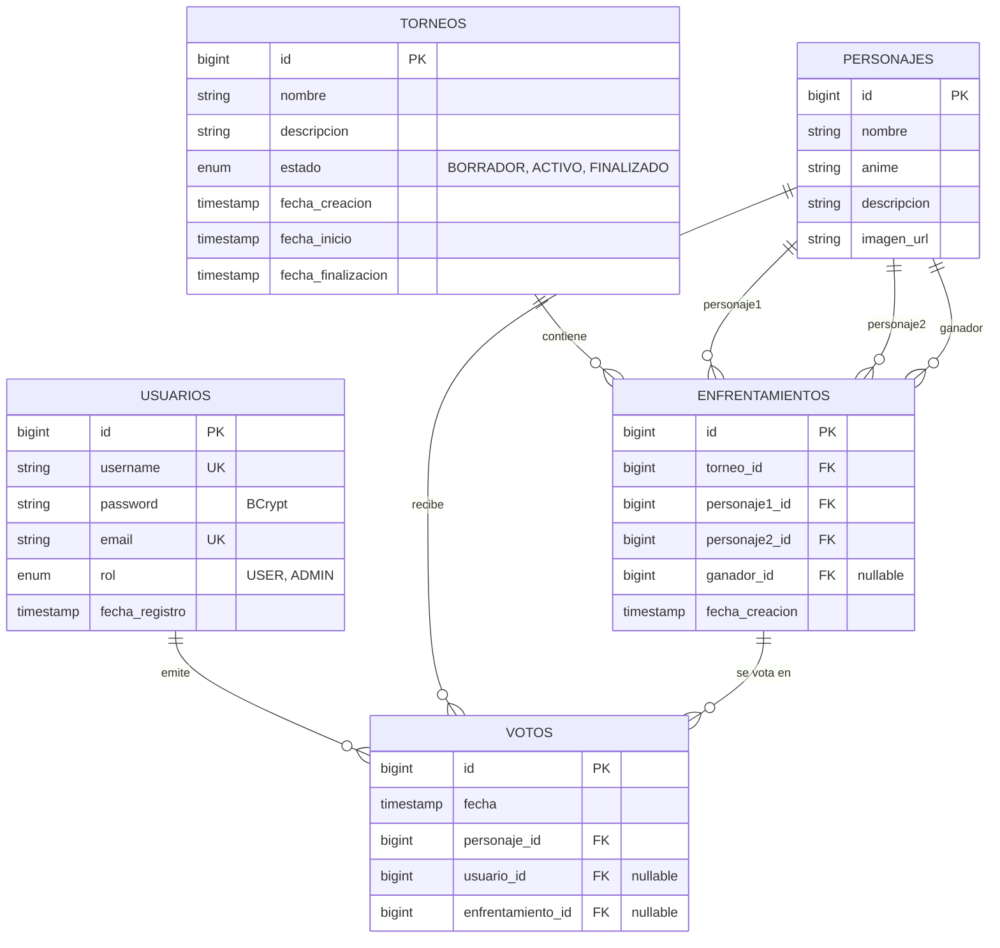
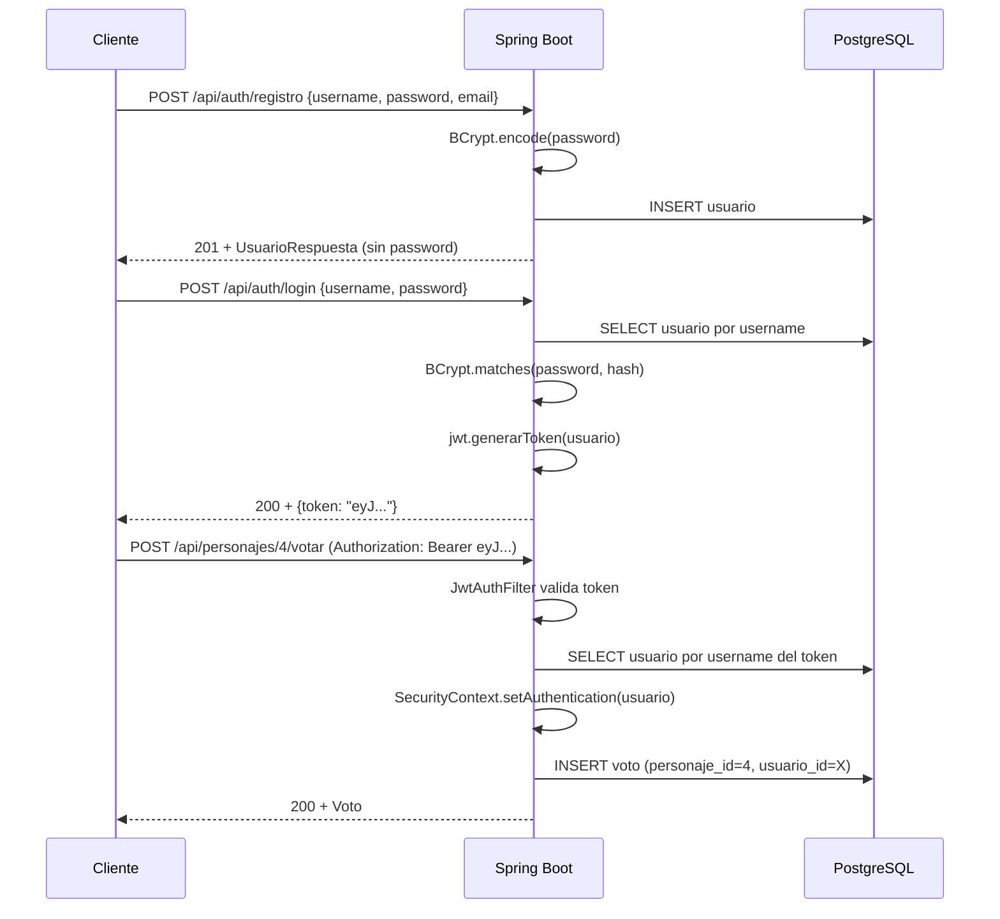

# AnimeShowdown


API REST de torneos y ranking de popularidad de personajes anime, con autenticación JWT, integración con la Jikan API (MyAnimeList) y persistencia en PostgreSQL.

> **Estado:** backend completo y desplegado. Frontend premium (React + Tailwind + Framer Motion) previsto para julio-agosto.

---

## Stack

- **Java 21** + **Spring Boot 3.5.14** (Web + Data JPA + Security + Validation + Actuator)
- **PostgreSQL 17** (Neon en producción, local en desarrollo)
- **JWT** con `com.auth0:java-jwt 4.4.0` y BCrypt para hashing de passwords
- **springdoc-openapi 2.8.5** (Swagger UI)
- **JUnit 5 + MockMvc + H2 in-memory** para tests
- **Jikan API v4** para importar personajes desde MyAnimeList
- **Maven Wrapper** + **Docker** multi-stage para deploy
- Hosting: **Render Free** (backend) + **Neon Free** (Postgres)

---

## Live

- **API base:** `https://animeshowdown.onrender.com` _(reemplazar con URL real cuando esté lista)_
- **Swagger UI:** `https://animeshowdown.onrender.com/swagger-ui/index.html`
- **OpenAPI JSON:** `https://animeshowdown.onrender.com/v3/api-docs`
- **Health check:** `https://animeshowdown.onrender.com/actuator/health`

> Render Free duerme tras 15 min sin tráfico → primera request tras inactividad tarda ~50s en despertar.

---

## Setup local

### Requisitos

- Java 21
- PostgreSQL 17 corriendo en `localhost:5432`
- Una BD `animeshowdown_db` y un user `animeshowdown_user`:

```sql
CREATE DATABASE animeshowdown_db;
CREATE USER animeshowdown_user WITH PASSWORD 'animeshowdown_dev_2026';
GRANT ALL PRIVILEGES ON DATABASE animeshowdown_db TO animeshowdown_user;
```

### Arranque

```bash
cd backend
./mvnw spring-boot:run
```

Spring levanta en `http://localhost:8080`. Hibernate (`ddl-auto=update`) crea/actualiza el esquema automáticamente.

### Tests

```bash
cd backend
./mvnw test
```

Cubre `AuthController` (registro, duplicado, validación, login OK/KO) con MockMvc + H2 in-memory.

---

## Variables de entorno

Todas las credenciales y rutas críticas se externalizan vía variables de entorno con defaults seguros para dev. Copia `backend/.env.example` a `backend/.env` y rellena.

| Variable | Default (dev) | Notas |
|---|---|---|
| `DATABASE_URL` | `jdbc:postgresql://localhost:5432/animeshowdown_db` | URL JDBC completa |
| `DB_USER` | `animeshowdown_user` | |
| `DB_PASSWORD` | `animeshowdown_dev_2026` | **regenerar en producción** |
| `JWT_SECRET` | clave dev hardcodeada | **generar con `openssl rand -base64 64` para prod** |
| `JWT_EXPIRATION` | `3600000` | ms (1 h) |
| `JPA_DDL` | `update` | `validate` o `none` en prod |
| `SHOW_SQL` | `true` | `false` en prod |
| `PORT` | `8080` | Render/Koyeb/Heroku lo inyectan |

---

## Modelo de datos



**Constraints clave:**
- `UNIQUE (personaje_id, usuario_id)` en `votos` → 1 voto por usuario por personaje
- `UNIQUE (enfrentamiento_id, usuario_id)` en `votos` → 1 voto por usuario por enfrentamiento

---

## Flujo de autenticación



---

## Endpoints

### Públicos (sin auth)

| Método | Path | Qué hace |
|---|---|---|
| POST | `/api/auth/registro` | Crea usuario nuevo (BCrypt). 409 si username duplicado. 400 si validación falla. |
| POST | `/api/auth/login` | Devuelve `{token: "..."}`. 401 en credenciales inválidas. |
| GET | `/api/personajes` | Lista todos. `?anime=Naruto` filtra. |
| GET | `/api/personajes/{id}` | Por id. 404 si no existe. |
| GET | `/api/votos/ranking` | Ranking agregado por COUNT de votos (JPQL). |
| GET | `/api/torneos` | Lista todos los torneos. |
| GET | `/actuator/health` | Healthcheck (UP/DOWN). |
| GET | `/v3/api-docs` | OpenAPI JSON. |
| GET | `/swagger-ui/index.html` | Swagger UI. |

### Protegidos (requieren JWT)

Cabecera: `Authorization: Bearer {token}`

| Método | Path | Qué hace |
|---|---|---|
| POST | `/api/personajes/{id}/votar` | Voto general. 409 si el usuario ya votó ese personaje. |
| POST | `/api/enfrentamientos/{id}/votar` | Body `{personajeGanadorId}`. 400 si no pertenece al enfrentamiento. 409 si torneo no ACTIVO o ya votó. |

### Solo ADMIN (`hasRole("ADMIN")`)

| Método | Path | Qué hace |
|---|---|---|
| POST/PUT/DELETE | `/api/personajes/**` | CRUD completo (todos menos GET). |
| POST/PUT/DELETE | `/api/torneos/**` | CRUD + iniciar/finalizar/crear enfrentamientos. |
| POST | `/api/admin/personajes/importar?cantidad=N` | Importa top N personajes desde Jikan. |

---

## Flujo de uso de ejemplo

```bash
BASE=https://animeshowdown.onrender.com   # o http://localhost:8080 en local

# 1. Registro
curl -X POST $BASE/api/auth/registro \
  -H "Content-Type: application/json" \
  -d '{"username":"diego","password":"naruto123","email":"diego@example.com"}'
# → 201 Created con {id, username, email, rol:"USER"} (sin password)

# 2. Login → guardar token
TOKEN=$(curl -s -X POST $BASE/api/auth/login \
  -H "Content-Type: application/json" \
  -d '{"username":"diego","password":"naruto123"}' | jq -r .token)

# 3. Votar (requiere JWT)
curl -X POST $BASE/api/personajes/4/votar \
  -H "Authorization: Bearer $TOKEN"
# → 200 OK con el voto creado. 409 si ya votaste a ese personaje.

# 4. Ver ranking público
curl $BASE/api/votos/ranking
```

---

## Despliegue

### Backend en Render Free

1. Cuenta en https://render.com con GitHub
2. New → Web Service → conectar repo `AnimeShowdown`
3. Configuración:
   - **Language:** Docker
   - **Root Directory:** `backend`
   - **Dockerfile Path:** `Dockerfile`
   - **Docker Build Context Directory:** `.`
   - **Region:** Frankfurt (o más cercano)
   - **Plan:** Free (512 MB / 0.1 CPU)
   - **Health Check Path:** `/actuator/health`
4. Environment Variables: las de la tabla de arriba (NO `PORT`, Render lo inyecta solo)
5. Deploy → ~10 min el primer build

### Postgres en Neon Free

1. Cuenta en https://neon.tech con GitHub
2. New Project → Postgres 17 → región Frankfurt
3. Copiar la connection string del dashboard
4. Construir `DATABASE_URL` con prefijo `jdbc:`:
   `jdbc:postgresql://HOST/DBNAME?sslmode=require`
5. Pegar `DB_USER`, `DB_PASSWORD` por separado en Render

---

## Logging

SLF4J en clases clave (formato Logback estándar de Spring Boot):

- `AuthController` → INFO en registro/login exitoso, WARN en duplicados o credenciales incorrectas
- `JwtAuthFilter` → WARN en JWT inválido o usuario inexistente
- `AdminController` → INFO en importación Jikan iniciada/completada

**Nunca se loggean** passwords, tokens completos ni datos personales sensibles.

---

## Limitaciones conocidas

- **Jikan import:** el endpoint `/top/characters` no incluye los animes asociados, así que el campo `anime` queda como `"Desconocido"` para personajes importados. Mejora futura: segunda llamada a `/characters/{mal_id}/anime`.
- **Empate en torneo:** si dos personajes empatan en votos al finalizar, `ganador` queda `NULL`.
- **Render Free sleep:** 50s de cold start tras 15 min de inactividad. Aceptable para portfolio; si se quisiera 24/7 sin esperas → Hobby plan ($5/mes) o migrar a otro provider.
- **Sin endpoint para promover a ADMIN:** se hace manualmente con `UPDATE usuarios SET rol = 'ADMIN' WHERE username = ?` en BD. Mejora futura: endpoint `/api/admin/usuarios/{id}/promover` que solo otros ADMIN puedan llamar.

---

## Roadmap

- [ ] Endpoint para promover usuarios a ADMIN
- [ ] Más tests (TorneoController, EnfrentamientoController, AdminController)
- [ ] Métricas más completas con Prometheus
- [ ] Frontend premium (React 18 + Vite + TypeScript + Tailwind + shadcn/ui + Framer Motion)
- [ ] Despliegue del frontend en Vercel
- [ ] Dominio custom (ej. `animeshowdown.dev`)

---

## Disclaimer

Este proyecto utiliza nombres, imágenes y descripciones de personajes de anime obtenidos de [Jikan API](https://jikan.moe/) (API no oficial de MyAnimeList). Todo el contenido pertenece a sus respectivos autores y casas productoras. Este software se distribuye únicamente con fines educativos y de aprendizaje, sin ánimo de lucro. Ver [`LICENSE`](LICENSE) (MIT) para los términos del código fuente del proyecto.

---

## Autor

Diego Gil — [@diegoalegil](https://github.com/diegoalegil) — diegogildam@gmail.com
