# AnimeShowdown

[](https://github.com/diegoalegil/AnimeShowdown/actions/workflows/test.yml)
[](https://github.com/diegoalegil/AnimeShowdown/actions/workflows/e2e.yml)


**Plataforma full-stack de duelos, rankings y torneos de personajes de anime.**

AnimeShowdown es una aplicación desplegada en producción para votar duelos 1v1, explorar rankings comunitarios, jugar pruebas diarias, seguir perfiles públicos y consultar una API REST abierta. La experiencia combina producto visual y base técnica seria: catálogo versionado, brackets en vivo, leaderboards, misiones, command palette, Open Graph dinámicas, PWA y observabilidad.

El catálogo actual contiene **1086 personajes únicos** distribuidos en **105 universos anime**, sincronizados desde imágenes locales hacia frontend, backend y datos seed.

<p align="center">
  <a href="https://animeshowdown.dev/">
    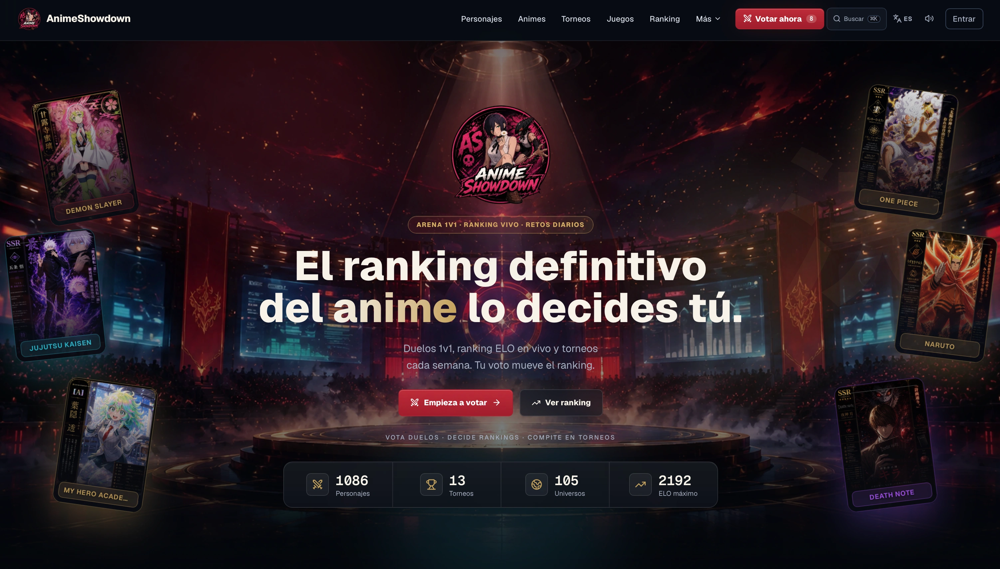
  </a>
</p>

## Demo

| Servicio | URL |
|---|---|
| Frontend | https://animeshowdown.dev |
| API base | https://api.animeshowdown.dev |
| API docs | https://animeshowdown.dev/api-docs |
| Swagger UI | https://api.animeshowdown.dev/swagger-ui/index.html |
| OpenAPI JSON | https://api.animeshowdown.dev/v3/api-docs |
| Healthcheck | https://api.animeshowdown.dev/actuator/health |
| Status monitor | https://animeshowdown.dev/status |

El tour de producto con los flujos clave está en [docs/DEMO.md](docs/DEMO.md).

## Screenshots

Haz clic en cualquier captura para abrir esa sección en producción.

| Votación 1v1 | Ranking ELO |
|---|---|
| [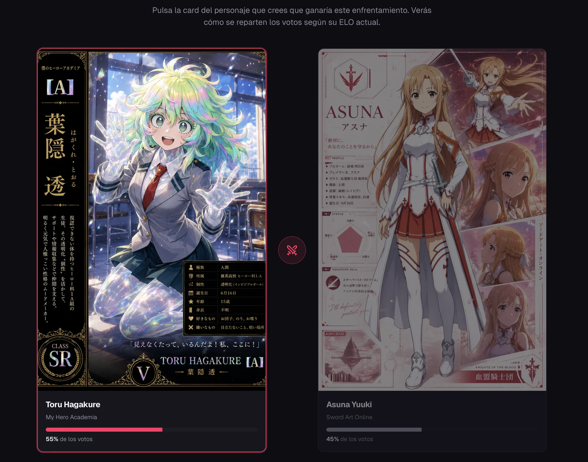](https://animeshowdown.dev/votar) | [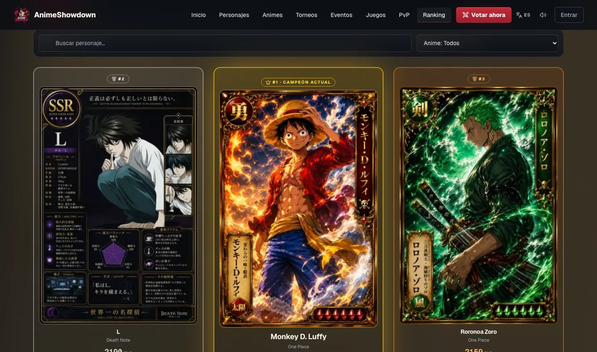](https://animeshowdown.dev/ranking) |

| Catálogo de personajes | Universos anime |
|---|---|
| [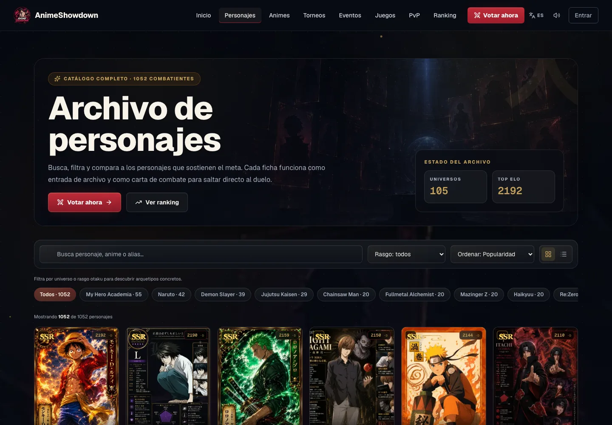](https://animeshowdown.dev/personajes) | [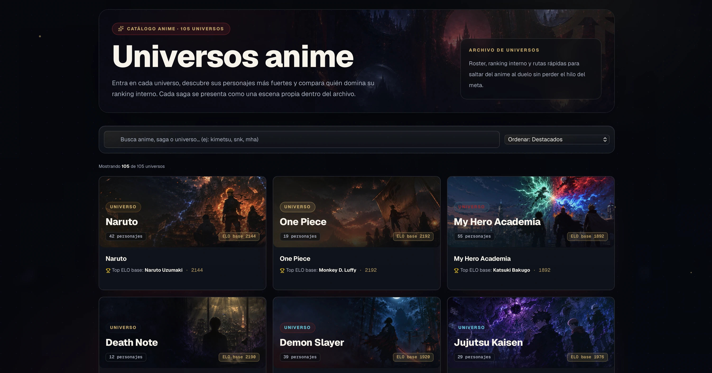](https://animeshowdown.dev/animes) |

| Universo Naruto | Anime Daily Trials |
|---|---|
| [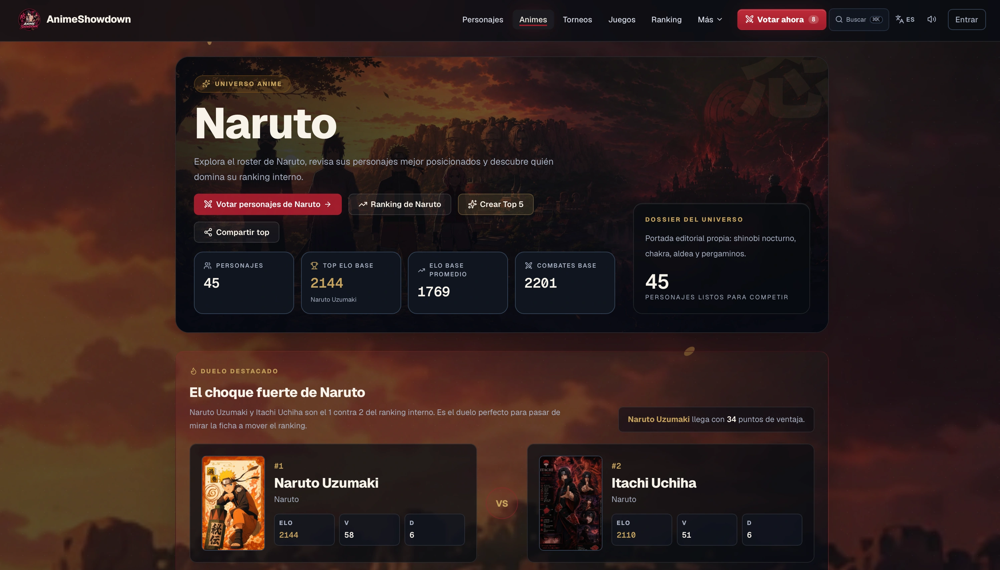](https://animeshowdown.dev/animes/naruto) | [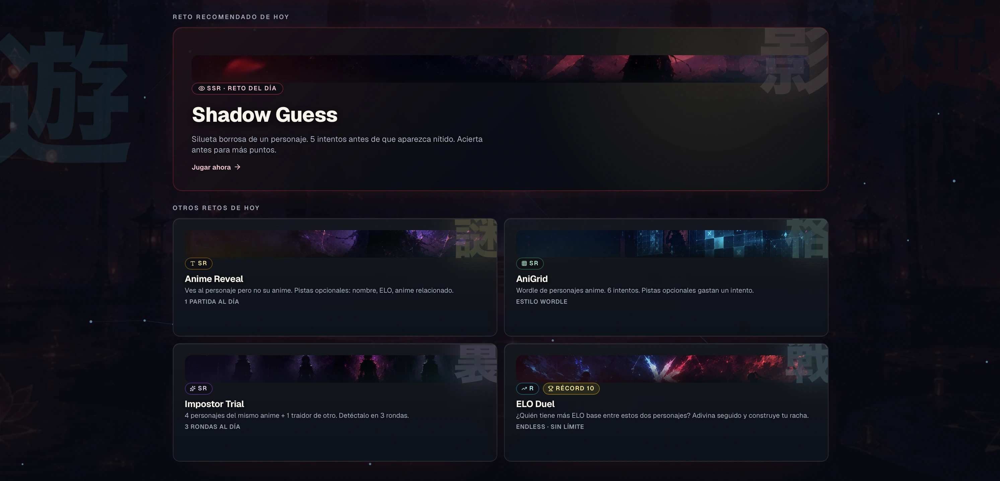](https://animeshowdown.dev/games) |

| Torneos en vivo | Ficha de personaje |
|---|---|
| [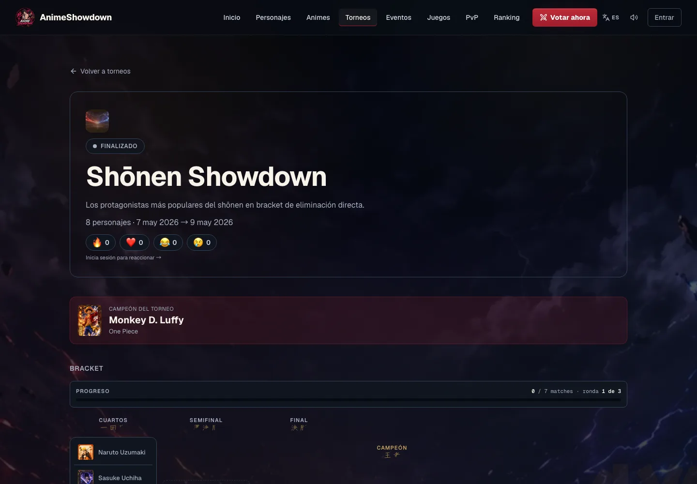](https://animeshowdown.dev/torneos/mha-heroes-vs-villains) | [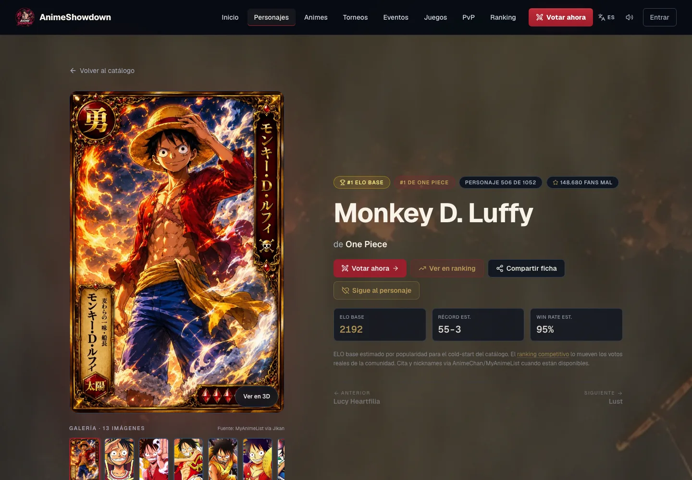](https://animeshowdown.dev/personajes/frieren) |

| API pública | Modo TV |
|---|---|
| [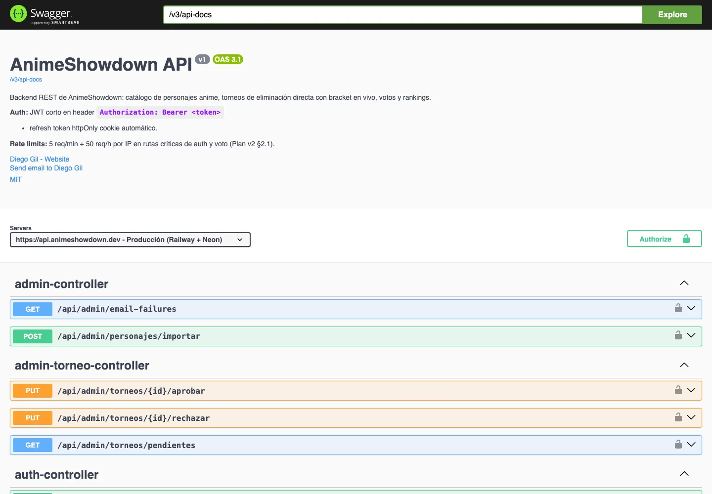](https://api.animeshowdown.dev/swagger-ui/index.html) | [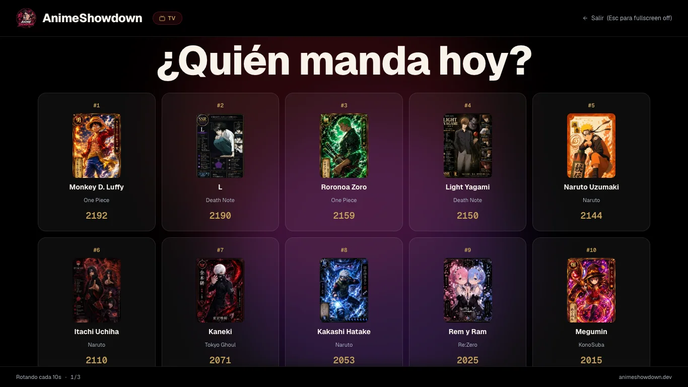](https://animeshowdown.dev/tv) |

## Features

- **Duelos 1v1** con ranking ELO, modo rápido, atajos de teclado, links exactos de votación, feedback visual, anti-repetición y votos anónimos o autenticados.
- **Ranking personal local** privado por navegador, alimentado por tus votos, con `/mi-top5` compartible y señales en fichas de personaje.
- **Ranking competitivo y leaderboards** con podio, histórico, filtros, búsqueda, vistas por anime, usuarios destacados e indicadores de movimiento.
- **Comparador y descubrimiento** para enfrentar dos personajes concretos, descubrir personajes al azar, abrir `/omikuji` y generar duelos recomendados.
- **Catálogo visual** de 1086 personajes con filtros, buscador, modo grid/list y fichas individuales.
- **Universos anime** con collages, stats agregadas, top interno y CTA para votar dentro de cada roster.
- **Torneos y eventos** con estados, participantes, duelos abiertos, avance de bracket, predicciones y temporadas temáticas.
- **Anime Daily Trials y misiones** con Shadow Guess, Anime Reveal, AniGrid, Impostor Trial, ELO Duel, progreso diario local y rachas.
- **Auth, perfiles y comunidad** con JWT, refresh cookie, OAuth Google/Discord, 2FA TOTP, avatares y banner de perfil, bio, follow, feed de actividad de tus seguidos, reacciones, perfiles públicos compartibles (con Open Graph propia) y 16 logros base.
- **Apoya, newsletter y páginas legales** integradas como parte del producto público.
- **UX avanzada** con command palette `Cmd+K`, notificaciones, Sonner, Web Audio API y PWA con Workbox.
- **SEO técnico** con sitemap, image sitemap, canonical, JSON-LD, robots y OG dinámicas para personajes, animes, torneos, ranking y duelos.

## Stack

### Frontend

| Área | Tecnología |
|---|---|
| UI | React 19, React Router 7, Tailwind CSS v4, Framer Motion 12 |
| Build | Vite 8, `@tailwindcss/vite`, Workbox, critical CSS inline |
| Datos | TanStack Query, TypeScript en `lib/*`, helpers locales de catálogo |
| Interacción | cmdk, Sonner, Lucide React, Web Audio API |
| Forms | react-hook-form 7 |
| Testing | Vitest, Testing Library, Playwright (E2E) |
| Observabilidad | Sentry + Web Vitals |

### Backend

| Área | Tecnología |
|---|---|
| Runtime | Java 21, Spring Boot 3.5.14 |
| API | Spring Web, Spring Security, Spring Validation, springdoc-openapi |
| Datos | PostgreSQL 17, Spring Data JPA, Flyway |
| Auth | JWT, refresh tokens httpOnly, TOTP cifrado, OAuth2 |
| Tiempo real | WebSocket STOMP |
| Resiliencia | Caffeine, Resilience4j, Actuator |
| Tests | JUnit 5, MockMvc, H2, JaCoCo (gate de cobertura en CI) |

## Arquitectura

```text
AnimeShowdown/
├── frontend/              # React + Vite + Tailwind + PWA
│   ├── img/               # Fuente visual del catálogo
│   ├── public/            # PWA, redirects, robots y sitemap
│   └── src/               # Rutas, páginas, componentes, hooks y helpers
├── backend/               # Spring Boot API
│   └── src/main/resources # Flyway, config y personajes-seed.json
├── scripts/               # Sync de catálogo, sitemap, smoke tests
└── docs/                  # Runbooks, Postman y capturas públicas
```

### Catálogo visual

`frontend/img/` es la fuente de verdad del catálogo. Cada personaje vive en:

```text
frontend/img/<Nombre_del_Anime>/<slug>.webp
```

El script de sincronización valida slugs, colisiones, nombres visibles y paridad con el seed backend:

```bash
node scripts/sync-personajes.mjs --check
node scripts/sync-personajes.mjs --dry-run
```

Las variantes responsive (`300`, `600`, `1024`, AVIF/WebP) ya están versionadas. En Cloudflare se usa `build:no-images` para no copiar `/img/` al artefacto: el build exige `ANIMESHOWDOWN_IMG_CDN_BASE_URL` y genera un redirect `/img/*` hacia ese origen externo. Ese origen debe contener el catálogo de `frontend/img/` y los stage assets de `frontend/public/img/`.

## Performance

Presupuesto Lighthouse de release: Performance >= 90, Accessibility >= 95, Best Practices >= 95 y SEO >= 95. Snapshot local de build producción desktop tomado el 2026-05-27 con `npm run build:no-images`, `vite preview` y `/img` servido desde el catálogo versionado:

| Ruta | Performance | A11y | Best Practices | SEO | CLS | LCP |
|---|---:|---:|---:|---:|---:|---:|
| `/` | 97 | 100 | 100 | 100 | 0.023 | 1.0s |
| `/votar` | 97 | 100 | 100 | 100 | 0.018 | 1.0s |
| `/ranking` | 97 | 100 | 100 | 100 | 0.008 | 1.1s |
| `/personajes/frieren` | 97 | 97 | 100 | 100 | 0.026 | 1.0s |
| `/torneos/mha-heroes-vs-villains` | 96 | 96 | 100 | 100 | 0.025 | 1.0s |
| `/games` | 98 | 100 | 100 | 100 | 0.005 | 1.0s |

Decisiones relevantes: el loader de rutas reserva altura estable para evitar saltos de footer durante la hidratación inicial, y las capas atmosféricas decorativas se mantienen dentro de su contenedor para no penalizar CLS.

## Setup local

### Requisitos

- Node 22 LTS.
- Java 21.
- PostgreSQL 17.
- Maven Wrapper incluido en `backend/`.

### Backend

```bash
cd backend
cp .env.example .env
./mvnw spring-boot:run
```

Spring levanta por defecto en `http://localhost:8080`. Configura `DATABASE_URL`, `DB_USER`, `DB_PASSWORD`, `JWT_SECRET` y `TOTP_ENCRYPTION_KEY` en tu `.env`.

### Frontend

```bash
cd frontend
cp .env.example .env.local
npm install
npm run dev
```

Vite levanta en `http://localhost:5173`. Para usar backend local:

```env
VITE_API_BASE_URL=http://localhost:8080
```

## Testing y QA

Validaciones recomendadas antes de publicar cambios:

```bash
cd frontend
npm run lint
ANIMESHOWDOWN_IMG_CDN_BASE_URL=https://assets.animeshowdown.dev/img npm run build:no-images
REQUIRE_EXTERNAL_IMAGE_CDN=true ANIMESHOWDOWN_IMG_CDN_BASE_URL=https://assets.animeshowdown.dev/img npm run test:bundle
npm run assets:cdn:plan

cd ../backend
./mvnw test

cd ..
bash scripts/smoke-test.sh
node scripts/sync-personajes.mjs --check
node scripts/qa/catalog-quality.mjs
node scripts/qa/contrast-check.mjs
```

El smoke test comprueba healthcheck, catálogo, filtro por anime, ranking público, Swagger, frontend, rutas SPA y login inválido con respuesta `401`.

Para Playwright local con backend real usa el perfil aislado `e2e`:

```bash
cd backend
SPRING_PROFILES_ACTIVE=e2e ./mvnw spring-boot:run -Dspring-boot.run.useTestClasspath=true

cd ../frontend
npm run build:e2e
npm run preview -- --host 127.0.0.1
npm run test:e2e:local
```

El perfil `e2e` usa H2 en memoria, cookies no-secure para HTTP local y no toca la base PostgreSQL local. El flag `useTestClasspath` es necesario porque H2 vive en scope `test`, fuera del artefacto de producción.

## Deploy

| Servicio | Uso |
|---|---|
| Cloudflare Pages | Frontend y dominio principal |
| Railway | Backend Spring Boot *(evaluando alternativas de hosting)* |
| Supabase | PostgreSQL 17 gestionado |
| Cloudflare R2 | CDN del catálogo de imágenes |
| Cloudflare Registrar | Dominio `.dev` |

Notas clave:

- Frontend root: `frontend`.
- Build command: `npm run build:no-images`.
- Output: `frontend/dist`.
- Required frontend env: `ANIMESHOWDOWN_IMG_CDN_BASE_URL=https://assets.animeshowdown.dev/img` o el origen equivalente que sirva el árbol público `/img/`.
- API pública: `https://api.animeshowdown.dev`.
- La raíz del subdominio API es solo base técnica y puede responder `403`; las entradas navegables son Swagger, OpenAPI JSON, `/api-docs` y healthcheck.
- SPA fallback y redirects: `frontend/public/_redirects`.
- `ProductionSecretsValidator` bloquea placeholders peligrosos fuera de test.
- Workbox cachea recursos estáticos y rutas API seleccionadas con estrategias diferenciadas.

### Sincronización del CDN de imágenes

El sync de `/img/` está separado del deploy de Cloudflare Pages para que el artefacto del frontend no cargue cientos de MB. Por seguridad, el comando local por defecto solo calcula el plan:

```bash
cd frontend
npm run assets:cdn:plan
```

Para una subida real a un origen R2/S3 compatible:

```bash
ANIMESHOWDOWN_IMG_CDN_BASE_URL=https://assets.animeshowdown.dev/img \
R2_IMG_ENDPOINT=https://<account-id>.r2.cloudflarestorage.com \
R2_IMG_ACCESS_KEY_ID=... \
R2_IMG_SECRET_ACCESS_KEY=... \
R2_IMG_BUCKET=animeshowdown-assets \
R2_IMG_PREFIX=img \
npm run assets:cdn:sync
```

El script no borra objetos remotos; solo sube/actualiza imágenes con `Cache-Control: public, max-age=3600, stale-while-revalidate=86400`. También existe el workflow manual `IMG CDN sync` para ejecutarlo desde GitHub Actions con secretos dedicados.

## API

La documentación interactiva está disponible en:

```text
https://api.animeshowdown.dev/swagger-ui/index.html
```

Endpoints públicos destacados:

- `GET /api/personajes`
- `GET /api/personajes/{slug}`
- `GET /api/votos/ranking`
- `GET /api/torneos`
- `GET /api/torneos/slug/{slug}`
- `GET /api/logros`
- `GET /api/status`
- `GET /api/og/personaje/{slug}.png`
- `GET /actuator/health`

La API completa incluye auth, perfiles públicos, logros, reacciones, follow, torneos, votos, predicciones, newsletter, observabilidad, Open Graph dinámicas y WebSocket.

## Estado

- Catálogo sincronizado: **1086 personajes**.
- Universos anime: **105**.
- Torneos visibles en producción: **15**; seed base versionado: **13**.
- Logros base publicados por API: **16**.
- Sitemap con rutas estáticas, personajes, animes, torneos públicos y perfiles públicos cuando el backend aporta datos; las landings masivas de duelos no se indexan.
- Fallback visual para imágenes de personaje y placeholders de carga/error.
- Ranking personal local, comparador, eventos, misiones, status, glosario, juegos diarios y descubrimiento enlazados en navegación, sitemap y command palette.
- PWA con manifest, service worker y cache controlado por Workbox.

## Documentación

- [Runbook general](RUNBOOK.md)
- [Deploy Railway](docs/runbooks/railway-deploy.md)
- [Sentry releases](docs/runbooks/sentry-release.md)
- [Seguridad](docs/SECURITY.md)
- [Postman](docs/postman/README.md)

## Licencia y disclaimer

Este proyecto usa licencia MIT. AnimeShowdown es un proyecto fan-made y no está afiliado a estudios, editoriales ni propietarios de las franquicias mencionadas. Los nombres, personajes y referencias pertenecen a sus respectivos titulares.
