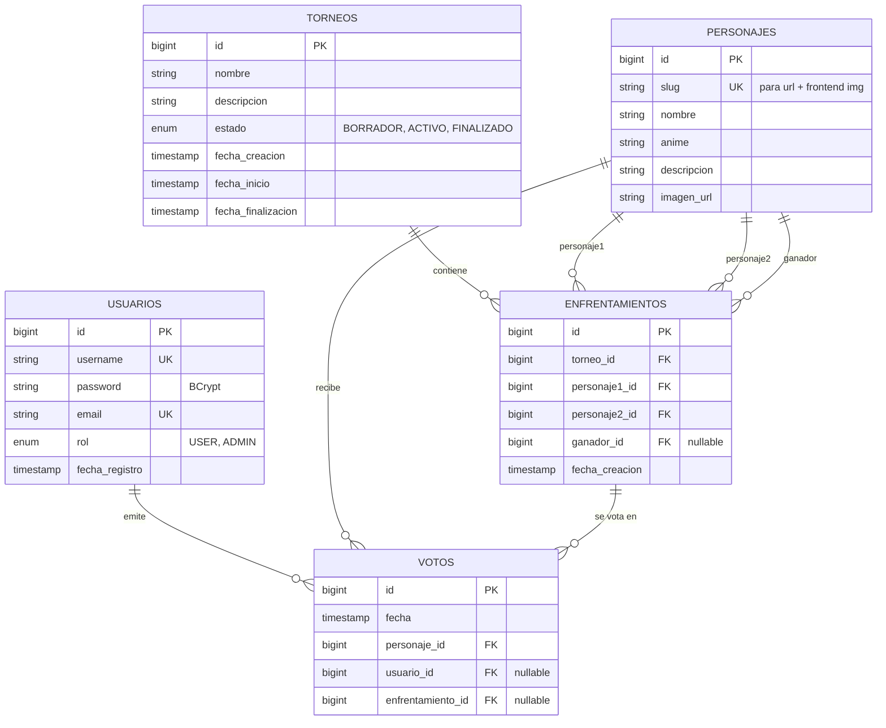

# AnimeShowdown


App full-stack de torneos y rankings ELO de personajes anime. Frontend React premium con aurora hero, carruseles tipo Crunchyroll, búsqueda + filtros, command palette tipo Linear, sonidos anime sintetizados con Web Audio API, bracket visual y auth real con JWT. Backend Spring Boot + PostgreSQL en Railway/Neon, frontend en Cloudflare Pages.

> **Estado:** ✅ Backend desplegado · ✅ Frontend desplegado · ✅ BBDD sincronizada con 642 personajes en 60 animes (DataSeeder con insert/update/delete cascade)

---

## Live

| Pieza | URL |
|---|---|
| **🌐 Frontend** | https://animeshowdown.dev |
| **🔌 API** | https://api.animeshowdown.dev |
| **📚 Swagger UI** | https://api.animeshowdown.dev/swagger-ui/index.html |
| **❤️ Health** | https://api.animeshowdown.dev/actuator/health |

> Hosting: **Cloudflare Pages** (frontend, free tier) + **Cloudflare Registrar** (dominio `.dev` $10.44/año) + **Railway Hobby** (backend, sin sleep) + **Neon Free** (Postgres en Frankfurt). Dominio `.dev` gestionado por Google con HTTPS forzado en TLD.

---

## Stack

### Frontend (`frontend/`)

- **React 19** + **Vite 8** (HMR + Rolldown bundler)
- **Tailwind CSS v4** vía `@tailwindcss/vite` con tokens nativos en `@theme` (paleta dark anime: `#0d0d12` bg + `#ff2e63` accent magenta)
- **Framer Motion 12** para animaciones, parallax mouse-tracked, AnimatePresence en transiciones de ruta
- **React Router 7** (BrowserRouter + 16 rutas — incluye `/higher-or-lower` mini-juego — + URL search params para filtros)
- **react-hook-form 7** para validación de formularios (Login + Register)
- **Lucide React** + SVG inline para iconografía
- **Sonner** para toast notifications
- **cmdk** (Vercel) para command palette `Cmd+K`
- **Web Audio API** sintetiza sonidos anime sin assets (7 efectos: click / hover / vote / whoosh / magic / impact / level-up)
- **Geist** + **Geist Mono** vía Google Fonts

### Backend (`backend/`)

- **Java 21** + **Spring Boot 3.5.14** (Web + Data JPA + Security + Validation + Actuator)
- **PostgreSQL 17** (Neon en producción, local en dev)
- **JWT** con `com.auth0:java-jwt 4.4.0` y BCrypt para hashing
- **springdoc-openapi 2.8.5** (Swagger UI)
- **DataSeeder con sincronización completa** que en cada arranque ajusta los 642 personajes desde `personajes-seed.json`: inserta nuevos, actualiza campos cambiados (imagenUrl, descripción, nombre, anime) y borra los retirados con cascada de votos y enfrentamientos (todo en `@Transactional`)
- **Resilience4j** sobre `JikanService` (retry exponencial + circuit breaker + timeout 5s) y **caché Caffeine** sobre las páginas top con TTL 1h
- **JUnit 5** + **MockMvc** + **H2** in-memory para tests
- **Maven Wrapper** + **Docker** multi-stage para deploy

### Tooling

- **Git** monorepo (`backend/` + `frontend/`)
- **GitHub** con auto-deploy a Cloudflare Pages (main → producción)
- **Postman** colección con 16 endpoints (`docs/postman/`) y entornos `local` + `railway`

---

## Capturas

> Capturas frescas tras el deploy. Más en `docs/screenshots/`.

**Hero animado con aurora multilayer + 8 cards flotantes con parallax**


**Galería de los 642 personajes con búsqueda, filtros por anime y view toggle**


**Detalle de torneo con bracket visual SVG**


**Detalle de personaje con stats ELO + récord + sección "Más de \[anime\]"**


**Pantalla de votación 1v1 con badge VS y reveal de porcentajes**


**Top 10 ELO con números gigantes outline magenta (Crunchyroll style)**


**Swagger UI del backend (17 paths · 21 operaciones)**


---

## Features destacadas del frontend

- 🎨 **Aurora multilayer** en Hero: 3 blobs animados (magenta + purple + cyan) con CSS keyframes desfasados
- 🎴 **8 cards flotantes** alrededor del logo con parallax mouse-tracked (3 niveles de profundidad)
- 🌀 **3D tilt + spotlight** en cada card del catálogo (mouse-tracked + spring smoothing)
- 🎠 **Carruseles horizontales por anime** estilo Netflix/Crunchyroll (snap-x scroll-smooth)
- 🏆 **Top 10 ELO** con números gigantes outline magenta solapando las cards (Crunchyroll vibe)
- ⚔️ **Live Battle widget** auto-cyclando matchups cada 5s con AnimatePresence
- 📜 **Marquee infinita** con los 642 nombres y fade en bordes
- 🔢 **Stats counter rolling** (642 personajes / 13 torneos / 60 animes / ELO máx) con easeOutCubic en viewport
- 🎁 **Bento grid** asimétrico con 4 features (Brackets, ELO, Cuenta, Comunidad)
- 🌳 **Bracket SVG** que computa rounds y resuelve por mayor ELO, ganador con border accent y glow
- ⌘ **Command palette** (`Cmd+K`) con cmdk: navega a páginas, personajes y torneos con búsqueda fuzzy
- 🔍 **Búsqueda + filtros + sort + grid/list toggle** en `/personajes` (estilo MyAnimeList)
- 🌐 **Filter persistente vía URL** (`/personajes?anime=Naruto`)
- 🎭 **404 con personaje random** y número outline magenta detrás
- 🎵 **Sonidos anime sintetizados** vía Web Audio API (7 efectos): click, hover, vote (acorde mayor + sparkle), whoosh, magic, impact, level-up. Toggle de mute en Header
- 🍞 **Toast notifications** (Sonner) en login/logout/voto
- 📊 **Progress bar** del scroll arriba con glow magenta
- 🪟 **Sticky Header frosted-glass** con backdrop-blur al scroll
- 🌑 **Texto shimmer animado** en H1 del Hero
- 🎯 **CTA pulse halo** en botón primario del Hero
- 📱 **Responsive** con prefers-reduced-motion respetado
- 🔐 **Auth real con JWT** (registro + login + olvidé contraseña con código por email vía Resend HTTP API + edición de avatar + rol ADMIN auto-promovido por `ADMIN_EMAILS` env)
- 🎮 **Higher or Lower** mini-juego en `/higher-or-lower`: adivina qué personaje tiene más ELO entre 2 cards, el ganador se queda y aparece nuevo retador, racha + récord histórico en localStorage
- 📧 **Sugiere personaje CTA** al final de `/personajes` y `/animes` con `mailto:` pre-rellenado a `noreply@animeshowdown.dev` (asunto + cuerpo URL-encoded para Mail.app, Gmail web, Outlook)

---

## Setup local

### Backend

```bash
# Requisitos: Java 21, PostgreSQL 17 en localhost:5432
psql -U postgres -c "CREATE DATABASE animeshowdown_db;"
psql -U postgres -c "CREATE USER animeshowdown_user WITH PASSWORD 'animeshowdown_dev_2026';"
psql -U postgres -c "GRANT ALL PRIVILEGES ON DATABASE animeshowdown_db TO animeshowdown_user;"

cd backend
./mvnw spring-boot:run
# Spring levanta en http://localhost:8080
# DataSeeder sincroniza los 642 personajes con el seed: inserta nuevos, actualiza cambios y borra retirados
```

### Frontend

```bash
# Requisitos: Node 22 LTS (vía nvm)
cd frontend
nvm use 22  # o nvm install 22 si no lo tienes
npm install
npm run dev
# Vite levanta en http://localhost:5173
```

Por defecto el frontend apunta al backend de Railway. Si quieres apuntarlo a tu backend local, crea `frontend/.env.local`:

```
VITE_API_URL=http://localhost:8080
```

### Tests

```bash
# Backend (JUnit + MockMvc + H2)
cd backend && ./mvnw test
```

---

## Variables de entorno

### Backend (`backend/.env`)

| Variable | Default (dev) | Notas |
|---|---|---|
| `DATABASE_URL` | `jdbc:postgresql://localhost:5432/animeshowdown_db` | URL JDBC completa |
| `DB_USER` | `animeshowdown_user` | |
| `DB_PASSWORD` | `animeshowdown_dev_2026` | **regenerar en producción** |
| `JWT_SECRET` | clave dev hardcodeada | **generar con `openssl rand -base64 64` para prod** |
| `JWT_EXPIRATION` | `3600000` | ms (1 h) |
| `JPA_DDL` | `update` | `validate` o `none` en prod |
| `SHOW_SQL` | `true` | `false` en prod |
| `PORT` | `8080` | Railway lo inyecta |

### Frontend (`frontend/.env.local`)

| Variable | Default | Notas |
|---|---|---|
| `VITE_API_URL` | URL pública de Railway | Apunta a tu backend local en dev si lo prefieres |

---

## Modelo de datos



**Constraints clave:**
- `UNIQUE (slug)` en `personajes` → cada personaje tiene un slug único que casa 1:1 con su WebP en el frontend
- `UNIQUE (personaje_id, usuario_id)` en `votos` → 1 voto por usuario por personaje
- `UNIQUE (enfrentamiento_id, usuario_id)` en `votos` → 1 voto por usuario por enfrentamiento

---

## Endpoints

### Públicos

| Método | Path | Qué hace |
|---|---|---|
| POST | `/api/auth/registro` | Crea usuario nuevo (BCrypt). 409 si username duplicado. |
| POST | `/api/auth/login` | Devuelve `{token: "..."}`. 401 en credenciales inválidas. |
| GET | `/api/personajes` | Lista todos. `?anime=Naruto` filtra. |
| GET | `/api/personajes/{id}` | Por id. 404 si no existe. |
| GET | `/api/votos/ranking` | Ranking agregado por COUNT (JPQL). |
| GET | `/api/torneos` | Lista todos los torneos. |
| GET | `/actuator/health` | Healthcheck. |
| GET | `/swagger-ui/index.html` | Swagger UI. |

### Protegidos (JWT)

| Método | Path | Qué hace |
|---|---|---|
| POST | `/api/personajes/{id}/votar` | Voto general. 409 si ya votó. |
| POST | `/api/enfrentamientos/{id}/votar` | Body `{personajeGanadorId}`. |

### ADMIN

| Método | Path | Qué hace |
|---|---|---|
| POST/PUT/DELETE | `/api/personajes/**` | CRUD completo. |
| POST/PUT/DELETE | `/api/torneos/**` | CRUD + iniciar/finalizar. |
| POST | `/api/admin/personajes/importar?cantidad=N` | Importa top N desde Jikan. |

---

## Despliegue

### Frontend en Cloudflare Pages

1. Cuenta en https://dash.cloudflare.com
2. Workers & Pages → Create → **Connect to Git** → autoriza GitHub
3. Selecciona `AnimeShowdown` → configura:
   - **Project name:** `animeshowdown`
   - **Production branch:** `main`
   - **Build command:** `npm run build`
   - **Build output directory:** `dist`
   - **Root directory** (advanced): `frontend`
4. **Environment variables:** `VITE_API_URL` = URL de tu backend
5. Save and Deploy → ~1-2 min y tienes `https://animeshowdown.pages.dev`
6. **`frontend/public/_redirects`** ya configurado con `/* /index.html 200` para SPA routing

### Backend en Railway

1. Cuenta en https://railway.app
2. New Project → Deploy from GitHub → `AnimeShowdown`
3. Settings → Root Directory: `backend` (Dockerfile auto-detectado)
4. Variables: las 7 de la tabla de arriba
5. Settings → Networking → Generate Domain (puerto 8080)

### Postgres en Neon Free

1. Cuenta en https://neon.tech
2. New Project → Postgres 17 → Frankfurt
3. Construir `DATABASE_URL` con prefijo `jdbc:` y `?sslmode=require`
4. En cada arranque, **DataSeeder** revisa qué slugs faltan en la tabla `personajes` y los inserta (idempotente, seguro de re-ejecutar en cualquier estado)

---

## Mantenimiento

### Añadir un personaje nuevo

`frontend/img/` es la **fuente de verdad** del catálogo. El flujo es:

1. Coloca el WebP en `frontend/img/<Nombre_del_Anime>/<slug>.webp` (ratio 2:3 recomendado, 1024x1536). El folder debe coincidir con uno de los registrados en `scripts/data/anime-display-names.json` o se añade una entrada nueva ahí mapeando folder → nombre legible.
2. (Opcional) Edita `scripts/data/personajes-overrides.json` para escribir nombre legible y descripción curada del nuevo personaje:
   ```json
   "mi_personaje": { "nombre": "Mi Personaje", "descripcion": "Descripción de 1-2 frases." }
   ```
   Sin override, el script deriva el nombre del slug (capitaliza palabras) y usa `"Personaje del anime {Anime}."` como descripción.
3. Ejecuta el sync:
   ```bash
   node scripts/sync-personajes.mjs
   ```
   Regenera `frontend/src/data/personajes.js` y `backend/src/main/resources/personajes-seed.json`. Soporta `--dry-run` para inspeccionar antes de escribir. Si el slug colisiona con otro anime (ej. `lucy` en Pokemon y Elfen Lied), el script los prefija automáticamente con el folder (`pokemon_lucy`, `elfen_lied_lucy`).
4. `git push` → Cloudflare rebuild + Railway redeploy. Al arrancar, el `DataSeeder` detecta el slug nuevo y lo inserta en BBDD; si retiraste alguno del seed lo borra con cascade de votos y enfrentamientos.

### Añadir un torneo nuevo

1. Edita `frontend/src/data/torneos.js` y añade un objeto:
   ```js
   {
     slug: 'mi-torneo',
     nombre: 'Mi Torneo',
     estado: 'en-curso', // o 'finalizado' o 'proximo'
     fechaInicio: '2026-06-01',
     fechaFin: null,
     participantes: ['naruto', 'luffy', ...], // 8 o 16 slugs
     winner: null,
   }
   ```
2. `git push` → Cloudflare redespliega → torneo aparece en `/torneos` y en el bracket

### Cambiar paleta o tipografía

- Paleta: edita los tokens en `frontend/src/index.css` dentro del bloque `@theme` (`--color-accent`, `--color-bg`, etc.)
- Tipografía: cambia el `<link>` de Google Fonts en `frontend/index.html` y los tokens `--font-sans`/`--font-mono` en `index.css`

### Ver logs

- **Frontend (Cloudflare):** dash.cloudflare.com → Workers & Pages → animeshowdown → Deployments → View build logs
- **Backend (Railway):** dashboard.railway.app → tu proyecto → Deployments → Logs

---

## Roadmap

- [x] Backend Spring Boot + JWT + PostgreSQL
- [x] Despliegue backend en Railway
- [x] Frontend React + Vite + Tailwind v4 + Framer Motion
- [x] Despliegue frontend en Cloudflare Pages
- [x] BBDD sincronizada con los 642 personajes (DataSeeder con insert/update/delete cascade desde `frontend/img/` como source of truth)
- [x] Auth real con JWT (registro + login + reset por email vía Resend + edición avatar + rol ADMIN)
- [x] Bracket visual SVG
- [x] Búsqueda + filtros + view toggle
- [x] Cmd+K command palette
- [x] Sonidos anime sintetizados
- [x] DataSeeder idempotente que sincroniza personajes incrementalmente (sin truncar BBDD)
- [x] Email transaccional vía Resend HTTP API con dominio verificado `noreply@animeshowdown.dev`
- [x] Dominio custom **animeshowdown.dev** (frontend) + **api.animeshowdown.dev** (backend) en Cloudflare Registrar + Cloudflare Pages + Railway custom domain
- [x] Cron de torneos automáticos (GitHub Actions cada 3 días → endpoint admin con login OAuth y secret)
- [x] Sitemap.xml dinámico (140+ URLs regeneradas en cada `npm run build`) + robots.txt
- [x] Headers de seguridad CSP + HSTS + X-Frame-Options + Permissions-Policy en Cloudflare Pages `_headers`
- [x] Tests backend ampliados a 23 (cobertura AuthController + TorneoController + EnfrentamientoController + /me + /me/avatar)
- [x] Mini-juego Higher or Lower con racha persistente en localStorage
- [x] Banner "Top votado en producción" en `/ranking` con fetch real al backend
- [x] CTA "Sugerir personaje" con `mailto:` pre-rellenado al final de `/personajes` y `/animes`
- [x] Hardening backend: email case-insensitive, reset-password anti-enumeration, JwtUtil sin info leak, PersonajeController PUT no destructivo, TorneoController `@Transactional`, validación distinct personajes
- [ ] Wirea `/votar` y `/personajes` al backend en producción (hoy `/ranking` ya hace fetch, pero `/votar` y catálogo siguen siendo local-only)
- [ ] Tests E2E con Playwright
- [ ] Refresh tokens (hoy JWT expira a 1h y obliga re-login)
- [ ] Rate limiting con bucket4j en `/forgot-password` y `/login` (anti brute-force)
- [ ] PWA + service worker para offline
- [ ] OG images dinámicas server-side

---

## Disclaimer

Este proyecto utiliza nombres e imágenes de personajes de anime con fines educativos. Todo el contenido pertenece a sus respectivos autores y casas productoras. Distribuido bajo [MIT](LICENSE) para el código fuente.

---

## Autor

Diego Gil — [@diegoalegil](https://github.com/diegoalegil) — diegogildam@gmail.com
