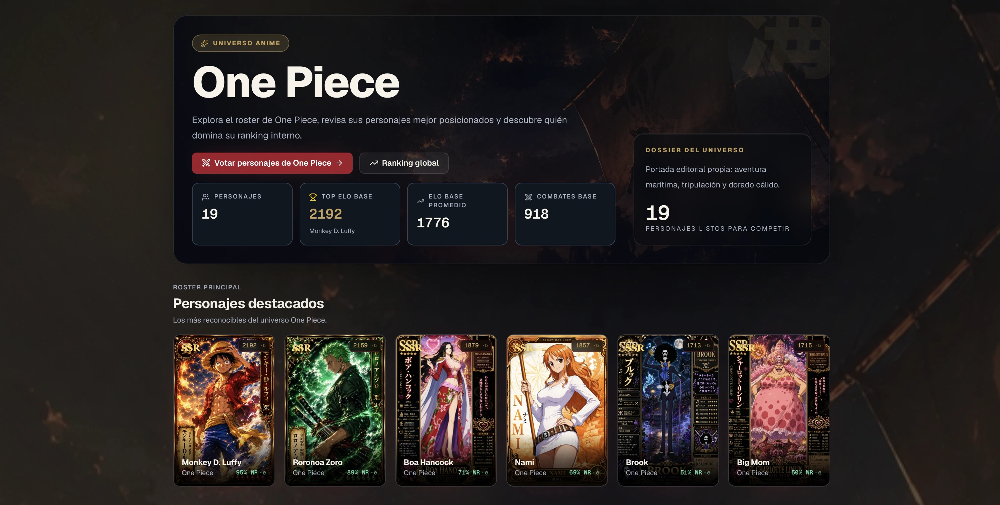

# AnimeShowdown


**El ranking definitivo del anime lo decides tú.**

AnimeShowdown es una plataforma full-stack de duelos 1v1, ranking ELO, torneos visuales y minijuegos diarios sobre personajes de anime. La experiencia está diseñada como un producto competitivo y cinemático: cards coleccionables, arena de votación, podios, brackets en vivo, perfiles sociales, command palette, sonido sintetizado y una PWA lista para producción.

El catálogo actual contiene **1052 personajes únicos** distribuidos en **105 universos anime**, sincronizados desde imágenes locales hacia frontend, backend y datos seed.

<p align="center">
  <a href="https://animeshowdown.dev/">
    
  </a>
</p>

## Demo

| Servicio | URL |
|---|---|
| Frontend | https://animeshowdown.dev |
| API | https://api.animeshowdown.dev |
| Swagger UI | https://api.animeshowdown.dev/swagger-ui/index.html |
| Healthcheck | https://api.animeshowdown.dev/actuator/health |

## Experiencia

Haz clic en cualquier captura para abrir esa sección en producción.

| Votación 1v1 | Ranking ELO |
|---|---|
| [](https://animeshowdown.dev/votar) | [](https://animeshowdown.dev/ranking) |

| Catálogo de personajes | Universos anime |
|---|---|
| [](https://animeshowdown.dev/personajes) | [](https://animeshowdown.dev/animes) |

| Naruto | One Piece |
|---|---|
| [](https://animeshowdown.dev/animes/naruto) | [](https://animeshowdown.dev/animes/one-piece) |

| Anime Daily Trials | Torneos en vivo |
|---|---|
| [](https://animeshowdown.dev/games) | [](https://animeshowdown.dev/torneos/mha-heroes-vs-villains) |

| Ficha de personaje | API pública |
|---|---|
| [](https://animeshowdown.dev/personajes/frieren) | [](https://api.animeshowdown.dev/swagger-ui/index.html) |

## Features

- **Duelos 1v1** con ranking ELO, modo rápido, atajos de teclado, feedback visual y votos anónimos o autenticados.
- **Ranking competitivo** con podio, histórico, filtros, búsqueda, vistas por anime e indicadores de movimiento.
- **Catálogo visual** de 1052 personajes con filtros, buscador, modo grid/list y fichas individuales.
- **Universos anime** con collages, stats agregadas, top interno y CTA para votar dentro de cada roster.
- **Torneos** con estados, participantes, duelos abiertos, avance de bracket y predicciones.
- **Anime Daily Trials** con Shadow Guess, Anime Reveal, AniGrid, Impostor Trial y ELO Duel.
- **Auth y perfil** con JWT, refresh cookie, OAuth Google/Discord, 2FA TOTP, avatares, follow, reacciones y actividad.
- **UX avanzada** con command palette `Cmd+K`, notificaciones, Sonner, Web Audio API y PWA con Workbox.
- **SEO técnico** con sitemap, image sitemap, canonical, Open Graph, JSON-LD, robots, `llms.txt` y páginas públicas indexables.

## Stack

### Frontend

| Área | Tecnología |
|---|---|
| UI | React 19, React Router 7, Tailwind CSS v4, Framer Motion 12 |
| Build | Vite 8, `@tailwindcss/vite`, Workbox, critical CSS inline |
| Datos | TanStack Query, helpers locales de catálogo, cache de browser |
| Interacción | cmdk, Sonner, Lucide React, Web Audio API |
| Forms | react-hook-form 7 |
| Observabilidad | Sentry + Web Vitals |

### Backend

| Área | Tecnología |
|---|---|
| Runtime | Java 21, Spring Boot 3.5.14 |
| API | Spring Web, Spring Security, Spring Validation, springdoc-openapi |
| Datos | PostgreSQL 17, Spring Data JPA, Flyway |
| Auth | JWT, refresh tokens httpOnly, TOTP cifrado, OAuth2 |
| Tiempo real | WebSocket STOMP |
| Resiliencia | Caffeine, Resilience4j, Actuator |
| Tests | JUnit 5, MockMvc, H2 |

## Arquitectura

```text
AnimeShowdown/
├── frontend/              # React + Vite + Tailwind + PWA
│   ├── img/               # Fuente visual del catálogo
│   ├── public/            # PWA, redirects, robots, sitemap, llms.txt
│   └── src/               # Rutas, páginas, componentes, hooks y helpers
├── backend/               # Spring Boot API
│   └── src/main/resources # Flyway, config y personajes-seed.json
├── scripts/               # Sync de catálogo, sitemap, smoke tests
└── docs/                  # Runbooks, Postman y capturas públicas
```

### Catálogo visual

`frontend/img/` es la fuente de verdad del catálogo. Cada personaje vive en:

```text
frontend/img/<Nombre_del_Anime>/<slug>.webp
```

El script de sincronización valida slugs, colisiones, nombres visibles y paridad con el seed backend:

```bash
node scripts/sync-personajes.mjs --check
node scripts/sync-personajes.mjs --dry-run
```

Las variantes responsive (`300`, `600`, `1024`, AVIF/WebP) ya están versionadas. En Cloudflare se usa `build:no-images` para no regenerarlas durante el deploy.

## Setup local

### Requisitos

- Node 22 LTS.
- Java 21.
- PostgreSQL 17.
- Maven Wrapper incluido en `backend/`.

### Backend

```bash
cd backend
cp .env.example .env
./mvnw spring-boot:run
```

Spring levanta por defecto en `http://localhost:8080`. Configura `DATABASE_URL`, `DB_USER`, `DB_PASSWORD`, `JWT_SECRET` y `TOTP_ENCRYPTION_KEY` en tu `.env`.

### Frontend

```bash
cd frontend
cp .env.example .env.local
npm install
npm run dev
```

Vite levanta en `http://localhost:5173`. Para usar backend local:

```env
VITE_API_URL=http://localhost:8080
```

## Calidad

Validaciones recomendadas antes de publicar cambios:

```bash
cd frontend
npm run lint
npm run build:no-images
npm run test:bundle

cd ../backend
./mvnw test

cd ..
bash scripts/smoke-test.sh
node scripts/sync-personajes.mjs --check
```

El smoke test comprueba healthcheck, catálogo, filtro por anime, ranking público, Swagger, frontend, rutas SPA y login inválido con respuesta `401`.

## Deploy

| Servicio | Uso |
|---|---|
| Cloudflare Pages | Frontend y dominio principal |
| Railway | Backend Spring Boot |
| Neon | PostgreSQL |
| Cloudflare Registrar | Dominio `.dev` |

Notas clave:

- Frontend root: `frontend`.
- Build command: `npm run build:no-images`.
- Output: `frontend/dist`.
- API pública: `https://api.animeshowdown.dev`.
- SPA fallback y redirects: `frontend/public/_redirects`.
- `ProductionSecretsValidator` bloquea placeholders peligrosos fuera de test.
- Workbox cachea recursos estáticos y rutas API seleccionadas con estrategias diferenciadas.

## API

La documentación interactiva está disponible en:

```text
https://api.animeshowdown.dev/swagger-ui/index.html
```

Endpoints públicos destacados:

- `GET /api/personajes`
- `GET /api/personajes/{slug}`
- `GET /api/votos/ranking`
- `GET /api/torneos`
- `GET /api/torneos/{slug}`
- `GET /actuator/health`

La API completa incluye auth, perfil, logros, reacciones, follow, torneos, votos, predicciones, newsletter, observabilidad y WebSocket.

## Estado

- Catálogo sincronizado: **1052 personajes**.
- Universos anime: **105**.
- Torneos seed: **13**.
- Sitemap con rutas estáticas, personajes, animes, torneos y duelos SEO.
- Fallback visual para imágenes de personaje y placeholders de carga/error.
- PWA con manifest, service worker y cache controlado por Workbox.

## Documentación

- [Runbook general](RUNBOOK.md)
- [Deploy Railway](docs/runbooks/railway-deploy.md)
- [Sentry releases](docs/runbooks/sentry-release.md)
- [Seguridad](docs/SECURITY.md)
- [Postman](docs/postman/README.md)

## Licencia y disclaimer

Este proyecto usa licencia MIT. AnimeShowdown es un proyecto fan-made y no está afiliado a estudios, editoriales ni propietarios de las franquicias mencionadas. Los nombres, personajes y referencias pertenecen a sus respectivos titulares.
