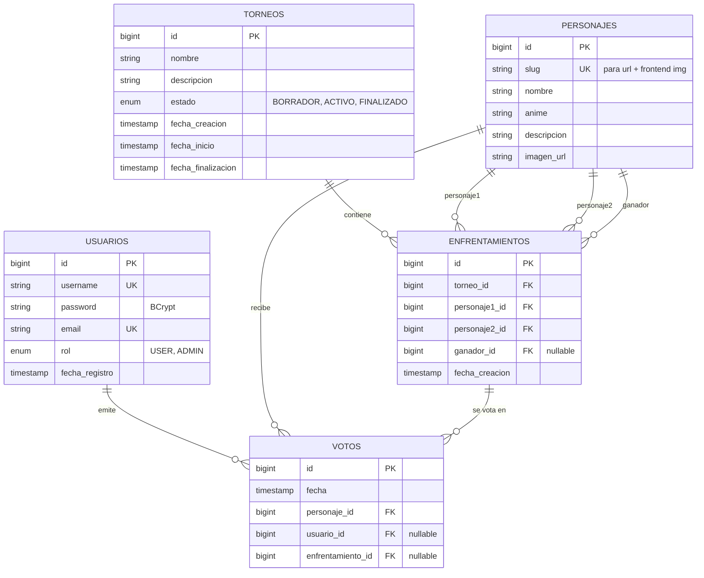

# AnimeShowdown


App full-stack de duelos, rankings ELO y torneos visuales de personajes anime. Frontend React premium con aurora hero, podio Top 3, Anime Daily Trials (5 mini-juegos diarios con kanji + sparkles), carruseles tipo Crunchyroll, búsqueda + filtros, command palette tipo Linear, sonidos anime sintetizados con Web Audio API, bracket visual y auth real con JWT + 2FA TOTP. Backend Spring Boot + PostgreSQL en Railway/Neon, frontend en Cloudflare Pages.

> **Estado:** ✅ Backend desplegado · ✅ Frontend desplegado · ✅ BBDD sincronizada con **1052 personajes únicos en 105 animes** (DataSeeder con insert/update/delete cascade) · ✅ Rebrand competitivo "El ranking definitivo del anime lo decides tú" · ✅ Audio performance audit (latencia <30ms por click)

---

## Live

| Pieza | URL |
|---|---|
| **🌐 Frontend** | https://animeshowdown.dev |
| **🔌 API** | https://api.animeshowdown.dev |
| **📚 Swagger UI** | https://api.animeshowdown.dev/swagger-ui/index.html |
| **❤️ Health** | https://api.animeshowdown.dev/actuator/health |

> Hosting: **Cloudflare Pages** (frontend, free tier) + **Cloudflare Registrar** (dominio `.dev` $10.44/año) + **Railway Hobby** (backend, sin sleep) + **Neon Free** (Postgres en Frankfurt). Dominio `.dev` gestionado por Google con HTTPS forzado en TLD.

---

## Stack

### Frontend (`frontend/`)

- **React 19** + **Vite 8** (HMR + Rolldown bundler)
- **Tailwind CSS v4** vía `@tailwindcss/vite` con tokens nativos en `@theme` (paleta dark anime: `#0d0d12` bg + `#ff2e63` accent magenta)
- **Framer Motion 12** para animaciones, parallax mouse-tracked, AnimatePresence en transiciones de ruta
- **React Router 7** (BrowserRouter + 24 rutas — incluye `/games` hub + 5 modos diarios — + URL search params para filtros + redirects 301 a nivel Cloudflare para rebrand de URLs)
- **react-hook-form 7** para validación de formularios (Login + Register)
- **Lucide React** + SVG inline para iconografía
- **Sonner** para toast notifications
- **cmdk** (Vercel) para command palette `Cmd+K`
- **Web Audio API** sintetiza sonidos anime sin assets (7 efectos: click / hover / vote / whoosh / magic / impact / level-up)
- **Geist** + **Geist Mono** vía Google Fonts

### Backend (`backend/`)

- **Java 21** + **Spring Boot 3.5.14** (Web + Data JPA + Security + Validation + Actuator)
- **PostgreSQL 17** (Neon en producción, local en dev)
- **JWT** con `com.auth0:java-jwt 4.4.0` y BCrypt para hashing
- **springdoc-openapi 2.8.5** (Swagger UI)
- **DataSeeder con sincronización completa** que en cada arranque ajusta los 1052 personajes desde `personajes-seed.json`: inserta nuevos, actualiza campos cambiados (imagenUrl, descripción, nombre, anime) y borra los retirados con cascada de votos y enfrentamientos (todo en `@Transactional`)
- **Resilience4j** sobre `JikanService` (retry exponencial + circuit breaker + timeout 5s) y **caché Caffeine** sobre las páginas top con TTL 1h
- **JUnit 5** + **MockMvc** + **H2** in-memory para tests
- **Maven Wrapper** + **Docker** multi-stage para deploy

### Tooling

- **Git** monorepo (`backend/` + `frontend/`)
- **GitHub** con auto-deploy a Cloudflare Pages (main → producción)
- **Postman** colección con 16 endpoints (`docs/postman/`) y entornos `local` + `railway`

---

## Capturas

> Capturas frescas tras el deploy. Más en `docs/screenshots/`.

**Hero animado con aurora multilayer + 8 cards flotantes con parallax**


**Galería de 1052 personajes con búsqueda, filtros, badges Top X y ELO+WR en cada card**


**Detalle de torneo con bracket visual SVG**


**Detalle de personaje con stats ELO + récord + sección "Más de \[anime\]"**


**Pantalla de votación 1v1 con badge VS y reveal de porcentajes**


**Top 10 ELO con números gigantes outline magenta (Crunchyroll style)**


**Swagger UI del backend (17 paths · 21 operaciones)**


---

## Features destacadas del frontend

### Home
- 🎨 **Aurora multilayer** en Hero: 3 blobs animados (magenta + purple + cyan) con CSS keyframes desfasados
- 🎴 **8 cards flotantes** alrededor del logo con parallax mouse-tracked (3 niveles de profundidad)
- 🌑 **Texto shimmer animado** en H1 — "El ranking definitivo del anime lo decides tú"
- ⚔️ **Duelo en vivo** auto-cyclando matchups cada 5s con AnimatePresence, VS pulsante con glow magenta y CTA "Votar este duelo"
- 🏆 **Top 10 ELO** con números gigantes outline magenta solapando las cards (Crunchyroll vibe)
- 🎮 **Anime Daily Trials** integrados en home como sección dedicada (5 modos con kanji: 影 / 謎 / 格 / 裏 / 戦)
- 🔢 **Stats compactos** sin "0 torneos" en vacío (sustituido por badge ping "Ranking en vivo")
- 🎁 **Bento grid** asimétrico con 4 features (Brackets estilo batalla, Ranking en directo, Tu historial, La comunidad decide)
- 📜 **Marquee infinita** con los 1052 nombres + fade en bordes (1300s/ciclo)

### Catálogo + Universos
- 🌀 **3D tilt + spotlight** en cada card del catálogo (mouse-tracked + spring smoothing) + ELO badge + WR + glow rosa en hover
- 🖼️ **PersonajePlaceholder anti-roto**: si una imagen falla, se renderiza una carta con iniciales del personaje + nombre + anime + kanji 戦 decorativo (nunca se muestra el icono roto del navegador)
- 🎠 **Carruseles horizontales por anime** estilo Netflix/Crunchyroll en home (snap-x scroll-smooth)
- 🔍 **Búsqueda + 7 filtros de orden + grid/list toggle** en `/personajes` (estilo MyAnimeList) — Popularidad, Mayor/Menor ELO, Mejor WR, Nombre A-Z/Z-A, Anime
- 🌌 **Universos anime** en `/animes/:slug` (ruta nueva): hero con collage representativo (top popularidad + top ELO, no random), stats agregados (Top ELO / ELO promedio / Combates), ranking interno con podio coloreado y CTA "Votar personajes de X"
- 🔎 **Buscador con aliases** en `/animes`: "kimetsu" encuentra Demon Slayer, "snk" Attack on Titan, "mha" My Hero Academia
- 🌐 **Filter persistente vía URL** (`/personajes?anime=Naruto`)
- 🎭 **404 con personaje random** y número outline magenta detrás

### Ranking & Votar
- 🥇 **Podio Top 3** en `/ranking` con campeón centrado grande (Crown + glow yellow), plata y bronce a los lados
- 📊 **4 tabs en ranking**: ELO actual / Histórico / Este mes / Por anime (con búsqueda y filtros)
- ⚔️ **Arena de duelo** en `/votar`: cards compactas que caben sin scroll, VS central con glow magenta, atajos de teclado (`←` `→` `S` `Espacio`), modo rápido auto-next (persistido en localStorage)
- 📋 **Tabla extraíble plegable** en ranking (datos técnicos) — preserva SEO para crawlers de IA sin competir con la experiencia visual

### Anime Daily Trials (`/games`)
- 🎌 **Hub épico** con kanji decorativo por modo + stats (Completados hoy / Mejor racha / Countdown reset)
- 👁️ **Shadow Guess** (`/games/shadow-guess`): silueta borrosa que se nitidiza con cada fallo, 5 intentos, "PERFECT CLEAR ✨" si aciertas al primero
- 📺 **Anime Reveal** (`/games/anime-reveal`): adivina el anime de un personaje con pistas opcionales
- 🔠 **AniGrid** (`/games/anigrid`): Wordle de personajes, 6 intentos con comparación letra/anime/ELO
- 🕵️ **Impostor Trial** (`/games/impostor-trial`): 4 cartas del mismo anime + 1 traidor, 3 rondas con kanji 裏
- ⚔️ **ELO Duel** (`/games/elo-duel`): Higher or Lower endless con VS animado + glow rosa al acercarse al récord
- 🎴 **PanelResultado anime**: kanji 結/残 decorativo + sparkles + 🌸/🍂 (en vez de 🟩🟥) + tiers ("Precisión legendaria", "Otaku certificado", "Telepatía pura"…)

### Plataforma
- ⌘ **Command palette** (`Cmd+K`) con cmdk: navega a páginas, personajes, torneos y modos con búsqueda fuzzy
- 🎵 **Sonidos anime sintetizados** vía Web Audio API (7 efectos sin assets) con `latencyHint:'interactive'` para baja latencia; toggle de mute en Header
- 🍞 **Toast notifications** (Sonner) en login/logout/voto/desbloqueo de logro
- 📊 **Progress bar** del scroll arriba con glow magenta
- 🪟 **Sticky Header frosted-glass** con backdrop-blur al scroll
- 📱 **Responsive** con prefers-reduced-motion respetado
- 🔐 **Auth real con JWT** + 2FA TOTP (registro + login en 2 pasos + reset por email vía Resend + edición avatar + rol ADMIN + backup codes one-shot)
- 🌳 **Bracket SVG** que computa rounds desde el backend con WebSocket STOMP (push live de actualizaciones tras cada voto)
- 🎯 **Predicciones de bracket** con badge verde/rojo al resolverse el torneo, ranking de profetas
- 🏅 **Sistema de logros** (14 badges seed) con `BadgeUnlockListener` global + canvas-confetti escalado por rareza
- ❤️ **Reactions emoji** (🔥❤️😂😭) en personajes y torneos
- 👥 **Follow asimétrico** con perfil público `/u/:username`
- 📧 **Sugiere personaje CTA** al final de `/personajes` y `/animes` con `mailto:` pre-rellenado
- 📰 **Newsletter** con double opt-in (Resend) + footer compacto
- 🎴 **Cards Perfil con tabs**: Resumen / Logros / Mis torneos / Ajustes (separa gamificación de seguridad)
- 💝 **Página /apoya** con cards Ko-fi + GitHub Sponsors + sección "¿En qué ayuda tu apoyo?" (hosting, BBDD, dominio) + "También puedes ayudar gratis" (compartir, star, sugerir)
- 🇯🇵 **Sakura petals** estacional (15 marzo → 15 abril) + 御籤 Omikuji diario integrado en hub de juegos
- ⌨️ **Easter egg Konami code** (↑↑↓↓←→←→BA) con overlay CRT verde 8s

---

## Setup local

### Backend

```bash
# Requisitos: Java 21, PostgreSQL 17 en localhost:5432
psql -U postgres -c "CREATE DATABASE animeshowdown_db;"
psql -U postgres -c "CREATE USER animeshowdown_user WITH PASSWORD 'animeshowdown_dev_2026';"
psql -U postgres -c "GRANT ALL PRIVILEGES ON DATABASE animeshowdown_db TO animeshowdown_user;"

cd backend
./mvnw spring-boot:run
# Spring levanta en http://localhost:8080
# DataSeeder sincroniza los 1052 personajes con el seed: inserta nuevos, actualiza cambios y borra retirados
```

### Frontend

```bash
# Requisitos: Node 22 LTS (vía nvm)
cd frontend
nvm use 22  # o nvm install 22 si no lo tienes
npm install
npm run dev
# Vite levanta en http://localhost:5173
```

Por defecto el frontend apunta al backend de Railway. Si quieres apuntarlo a tu backend local, crea `frontend/.env.local`:

```
VITE_API_URL=http://localhost:8080
```

### Tests

```bash
# Backend (JUnit + MockMvc + H2)
cd backend && ./mvnw test
```

---

## Variables de entorno

### Backend (`backend/.env`)

> **Aviso (audit P3 2026-05-17):** desde `ProductionSecretsValidator` el boot
> aborta si `DB_PASSWORD`, `JWT_SECRET` o `TOTP_ENCRYPTION_KEY` arrancan con
> el placeholder `CHANGE_ME_IN_PROD…` fuera del profile `test`. Hay que
> definirlos antes de arrancar la app en local sin profile test o en Railway.

| Variable | Valor sugerido | Notas |
|---|---|---|
| `DATABASE_URL` | `jdbc:postgresql://localhost:5432/animeshowdown_db` | URL JDBC completa |
| `DB_USER` | `animeshowdown_user` | |
| `DB_PASSWORD` | generar local + Neon | requerido en boot no-test |
| `JWT_SECRET` | `openssl rand -base64 64` | requerido en boot no-test |
| `TOTP_ENCRYPTION_KEY` | `openssl rand -base64 32` | requerido en boot no-test |
| `JWT_EXPIRATION` | `900000` | ms (15 min) — refresh cookie cubre los 30 d |
| `JPA_DDL` | `update` | `validate` o `none` en prod |
| `SHOW_SQL` | `true` | `false` en prod |
| `PORT` | `8080` | Railway lo inyecta |
| `ADMIN_EMAILS` | `tu_email@dominio` | promueve a ADMIN tras verificar email |
| `APP_CRON_SECRET` | string random largo | header `X-Cron-Secret` del cron |
| `GOOGLE_CLIENT_ID` | Google Cloud Console | OAuth Google |
| `GOOGLE_CLIENT_SECRET` | Google Cloud Console | OAuth Google |
| `DISCORD_CLIENT_ID` | Discord Developer Portal | OAuth Discord |
| `DISCORD_CLIENT_SECRET` | Discord Developer Portal | OAuth Discord |
| `APP_OAUTH_REDIRECT_BASE` | `https://animeshowdown.dev` | frontend al que vuelve OAuth (`/auth/callback`) |

### Frontend (`frontend/.env.local`)

| Variable | Default | Notas |
|---|---|---|
| `VITE_API_URL` | `https://api.animeshowdown.dev` | En prod debe ser el subdominio API, no el dominio bruto de Railway. Apunta a tu backend local en dev si lo prefieres |

### OAuth setup

AnimeShowdown soporta login/signup con Google y Discord usando el flujo OAuth2 de Spring Security. El backend recibe el callback, linkea por email si ya existe una cuenta, o crea un usuario `ACTIVO` nuevo si el email viene verificado por el proveedor. Después emite la misma cookie `refresh_token` httpOnly que el login clásico y redirige al frontend `/auth/callback`, donde la SPA recupera el JWT corto vía `/api/auth/refresh`.

**Google Cloud Console**

1. Crea un OAuth Client tipo Web application.
2. Authorized JavaScript origins: `https://api.animeshowdown.dev` y, para local, `http://localhost:8080`.
3. Authorized redirect URIs:
   - `https://api.animeshowdown.dev/login/oauth2/code/google`
   - `http://localhost:8080/login/oauth2/code/google` si pruebas local.
4. Copia `Client ID` → `GOOGLE_CLIENT_ID` y `Client secret` → `GOOGLE_CLIENT_SECRET` en Railway.

**Discord Developer Portal**

1. Crea una app en Discord Developer Portal → OAuth2.
2. Redirects:
   - `https://api.animeshowdown.dev/login/oauth2/code/discord`
   - `http://localhost:8080/login/oauth2/code/discord` si pruebas local.
3. Scopes usados por la app: `identify email`.
4. Copia `Client ID` → `DISCORD_CLIENT_ID` y `Client Secret` → `DISCORD_CLIENT_SECRET` en Railway.

En Railway define también `APP_OAUTH_REDIRECT_BASE=https://animeshowdown.dev`. En desarrollo local puedes usar `APP_OAUTH_REDIRECT_BASE=http://localhost:5173` y `FRONTEND_BASE_URL=http://localhost:5173`.

---

## Modelo de datos



**Constraints clave:**
- `UNIQUE (slug)` en `personajes` → cada personaje tiene un slug único que casa 1:1 con su WebP en el frontend
- `UNIQUE (personaje_id, usuario_id)` en `votos` → 1 voto por usuario por personaje
- `UNIQUE (enfrentamiento_id, usuario_id)` en `votos` → 1 voto por usuario por enfrentamiento

---

## Endpoints

### Públicos

| Método | Path | Qué hace |
|---|---|---|
| POST | `/api/auth/registro` | Crea usuario nuevo (BCrypt). 409 si username duplicado. |
| POST | `/api/auth/login` | Devuelve `{token: "..."}`. 401 en credenciales inválidas. |
| GET | `/api/personajes` | Lista todos. `?anime=Naruto` filtra. |
| GET | `/api/personajes/{id}` | Por id. 404 si no existe. |
| GET | `/api/votos/ranking` | Ranking agregado por COUNT (JPQL). |
| GET | `/api/torneos` | Lista todos los torneos. |
| GET | `/actuator/health` | Healthcheck. |
| GET | `/swagger-ui/index.html` | Swagger UI. |

### Protegidos (JWT)

| Método | Path | Qué hace |
|---|---|---|
| POST | `/api/personajes/{id}/votar` | Voto general. 409 si ya votó. |
| POST | `/api/enfrentamientos/{id}/votar` | Body `{personajeGanadorId}`. |

### ADMIN

| Método | Path | Qué hace |
|---|---|---|
| POST/PUT/DELETE | `/api/personajes/**` | CRUD completo. |
| POST/PUT/DELETE | `/api/torneos/**` | CRUD + iniciar/finalizar. |
| POST | `/api/admin/personajes/importar?cantidad=N` | Importa top N desde Jikan. |

---

## Despliegue

### Frontend en Cloudflare Pages

1. Cuenta en https://dash.cloudflare.com
2. Workers & Pages → Create → **Connect to Git** → autoriza GitHub
3. Selecciona `AnimeShowdown` → configura:
   - **Project name:** `animeshowdown`
   - **Production branch:** `main`
   - **Build command:** `npm run build:no-images` (las variantes responsive `-300.webp` y `-600.webp` ya están commiteadas al repo desde 2026-05-17 para que CF no tenga que regenerarlas y esquive el timeout de 20 min del free tier; `build:no-images` solo regenera sitemap + bundle)
   - **Build output directory:** `dist`
   - **Root directory** (advanced): `frontend`
4. **Environment variables:** `VITE_API_URL=https://api.animeshowdown.dev` en producción. No uses el dominio bruto de Railway aquí: rompe cookies de refresh y OAuth social.
5. Save and Deploy → ~1-2 min y tienes `https://animeshowdown.pages.dev`
6. **`frontend/public/_redirects`** ya configurado con `/* /index.html 200` para SPA routing

### Backend en Railway

1. Cuenta en https://railway.app
2. New Project → Deploy from GitHub → `AnimeShowdown`
3. Settings → Root Directory: `backend` (Dockerfile auto-detectado)
4. Variables: las 7 de la tabla de arriba
5. Settings → Networking → Generate Domain (puerto 8080)

### Postgres en Neon Free

1. Cuenta en https://neon.tech
2. New Project → Postgres 17 → Frankfurt
3. Construir `DATABASE_URL` con prefijo `jdbc:` y `?sslmode=require`
4. En cada arranque, **DataSeeder** revisa qué slugs faltan en la tabla `personajes` y los inserta (idempotente, seguro de re-ejecutar en cualquier estado)

---

## Mantenimiento

### Añadir un personaje nuevo

`frontend/img/` es la **fuente de verdad** del catálogo. El flujo es:

1. Coloca el WebP en `frontend/img/<Nombre_del_Anime>/<slug>.webp` (ratio 2:3 recomendado, 1024x1536). El folder debe coincidir con uno de los registrados en `scripts/data/anime-display-names.json` o se añade una entrada nueva ahí mapeando folder → nombre legible.
2. (Opcional) Edita `scripts/data/personajes-overrides.json` para escribir nombre legible y descripción curada del nuevo personaje:
   ```json
   "mi_personaje": { "nombre": "Mi Personaje", "descripcion": "Descripción de 1-2 frases." }
   ```
   Sin override, el script deriva el nombre del slug (capitaliza palabras) y usa `"Personaje del anime {Anime}."` como descripción.
3. Ejecuta el sync:
   ```bash
   node scripts/sync-personajes.mjs
   ```
   Regenera `frontend/src/data/personajes.js` y `backend/src/main/resources/personajes-seed.json`. Soporta `--dry-run` para inspeccionar antes de escribir. Si el slug colisiona con otro anime (ej. `lucy` en Pokemon y Elfen Lied), el script los prefija automáticamente con el folder (`pokemon_lucy`, `elfen_lied_lucy`).
4. `git push` → Cloudflare rebuild + Railway redeploy. Al arrancar, el `DataSeeder` detecta el slug nuevo y lo inserta en BBDD; si retiraste alguno del seed lo borra con cascade de votos y enfrentamientos.

### Añadir un torneo nuevo

1. Edita `frontend/src/data/torneos.js` y añade un objeto:
   ```js
   {
     slug: 'mi-torneo',
     nombre: 'Mi Torneo',
     estado: 'en-curso', // o 'finalizado' o 'proximo'
     fechaInicio: '2026-06-01',
     fechaFin: null,
     participantes: ['naruto', 'luffy', ...], // 8 o 16 slugs
     winner: null,
   }
   ```
2. `git push` → Cloudflare redespliega → torneo aparece en `/torneos` y en el bracket

### Cambiar paleta o tipografía

- Paleta: edita los tokens en `frontend/src/index.css` dentro del bloque `@theme` (`--color-accent`, `--color-bg`, etc.)
- Tipografía: cambia el `<link>` de Google Fonts en `frontend/index.html` y los tokens `--font-sans`/`--font-mono` en `index.css`

### Ver logs

- **Frontend (Cloudflare):** dash.cloudflare.com → Workers & Pages → animeshowdown → Deployments → View build logs
- **Backend (Railway):** dashboard.railway.app → tu proyecto → Deployments → Logs

---

## Roadmap

### Core (✅ completo)
- [x] Backend Spring Boot + JWT + PostgreSQL + Flyway (V1-V12)
- [x] Despliegue backend en Railway, frontend en Cloudflare Pages
- [x] BBDD sincronizada con **1052 personajes en 105 animes** (DataSeeder con insert/update/delete cascade)
- [x] Dominio custom **animeshowdown.dev** + **api.animeshowdown.dev**
- [x] Email transaccional vía Resend HTTP API con dominio verificado

### Auth & Seguridad (✅ completo)
- [x] JWT + refresh tokens en httpOnly cookies (15min/30d) + auto-refresh on 401
- [x] 2FA TOTP con `dev.samstevens.totp` + backup codes one-shot + login en 2 pasos
- [x] Email verification + banner persistente + página `/verify`
- [x] Password complexity + medidor visual
- [x] Rate limiting Bucket4j (5/min + 50/h por IP en rutas críticas)
- [x] Account lockout 5 intentos / 15min
- [x] Audit log con 14 eventos cubriendo auth + sessions
- [x] Headers de seguridad CSP + HSTS + X-Frame-Options + Permissions-Policy

### Engagement (✅ completo)
- [x] Sistema de logros (14 badges) con eventos `@TransactionalEventListener` + notif + confetti
- [x] Reactions (🔥❤️😂😭) en personajes y torneos
- [x] Predicciones de bracket con resolución automática al finalizar torneo
- [x] Follow asimétrico + perfil público `/u/:username`
- [x] Ranking segmentado: ELO actual / Histórico / Este mes / Por anime
- [x] Newsletter double opt-in con tokens UUID
- [x] Torneos creados por usuarios con flow APROBADO/RECHAZADO + admin

### Notificaciones (✅ completo)
- [x] WebSocket STOMP con `JwtAuthChannelInterceptor` + tabla `notificaciones` + 4 tipos
- [x] NotifBell en Header con dropdown live + badge unread + push tras voto
- [x] Bracket update en tiempo real tras cada voto en torneo activo

### Anime Daily Trials (✅ completo MVP)
- [x] Hub `/games` con 5 modos diarios + countdown reset + Omikuji integrado
- [x] **Shadow Guess** (silueta borrosa, 5 intentos, PERFECT CLEAR)
- [x] **Anime Reveal** (adivina el anime con pistas)
- [x] **AniGrid** (Wordle de personajes, 6 intentos)
- [x] **Impostor Trial** (4 cartas mismo anime + 1 traidor, 3 rondas)
- [x] **ELO Duel** (Higher or Lower con racha persistente)
- [x] PanelResultado anime compartido con kanji 結/残 + sparkles + 🌸/🍂
- [x] "Jugar otra ronda" tras completar el daily (sin afectar progreso oficial)
- [x] Redirects 301 a nivel Cloudflare para rebrand de URLs (`guess-character` → `shadow-guess` etc.)

### Cultura japonesa (✅ parcial 9/16)
- [x] Sakura petals estacional (15 marzo → 15 abril) con override localStorage
- [x] Omikuji diario con 5 suertes tradicionales
- [x] Glossary otaku `/glossary` con 30 términos + JsonLd DefinedTermSet
- [x] Kanji decorativo de fondo en cards de juegos + paneles de resultado + universo anime
- [x] Easter egg Konami code (↑↑↓↓←→←→BA) con overlay CRT verde

### SEO + GEO LLMs (✅ completo)
- [x] `useSeo` hook custom con title + description + canonical + OG + Twitter + hreflang
- [x] JSON-LD: WebSite + Person + SportsEvent + CollectionPage + BreadcrumbList + FAQPage + DefinedTermSet
- [x] Microdata schema.org en ficha de personaje y torneo (Person + TVSeries + SportsEvent)
- [x] `llms.txt` + API docs públicos en `/api-docs` + tabla extraíble en ranking
- [x] FAQ con schema rich snippet + Internal linking estructurado en todas las páginas
- [x] IndexNow para Bing/Yandex/Seznam tras torneos UGC aprobados o autogenerados
- [x] Core Web Vitals: preload del logo Hero con fetchpriority=high

### PWA + Performance (✅ completo)
- [x] PWA con Workbox: CacheFirst /img/* y /api/og/*, NetworkFirst /api/personajes y /api/torneos
- [x] AVIF + WebP responsive `<picture>` srcset 300/600/1024 (generador en build con sharp; build full opcional)
- [x] Critical CSS inline con beasties (~5KB above-the-fold + bundle async)
- [x] Bundle size budget 250KB gzip en CI
- [x] Sentry + Web Vitals tracking con GDPR-safe defaults

### Frontend rebrand "Plataforma de duelos" (✅ completo)
- [x] Home: "El ranking definitivo del anime lo decides tú" + CTAs Votar / Ranking
- [x] Ranking: podio Top 3 visual (Crown + glow yellow / plata / bronce) + búsqueda + filtros
- [x] Votar: arena compacta sin scroll + VS pulsante con glow + atajos teclado (← → S Espacio) + modo rápido
- [x] Personajes: PersonajePlaceholder anti-roto + cards con ELO + WR + badge Top X
- [x] Animes: página individual `/animes/:slug` con stats agregados + roster + ranking interno + CTAs
- [x] Apoya: cards Ko-fi + GitHub Sponsors + costes reales + "También puedes ayudar gratis"
- [x] Perfil con tabs (Resumen / Logros / Mis torneos / Ajustes)

### Operations (✅ parcial)
- [x] DevOps: Dependabot scan semanal + groupings (react-vendor, i18n, tanstack…)
- [x] Backups Neon → Cloudflare R2 (cron diario, rotación daily/weekly/monthly)
- [x] Páginas legales: Privacy + Terms + DMCA con Footer extendido
- [x] CI verde con tests backend 114/114
- [x] **RUNBOOK.md** con procedimientos de incidente (9 escenarios + smoke test)
- [x] CatalogoHealthIndicator custom en `/actuator/health` detecta BBDD vacía o catálogo contaminado

### Polish + meta (✅ creciendo)
- [x] **Page pública /logros** + perfil público `/u/:username/logros` con grid de cards + rareza WoW + stats comunidad
- [x] **Recomendaciones cross-anime** "Si te gusta X, también te gustarán" en ficha de personaje
- [x] **Eliminar cuenta** (GDPR right to erasure) con doble confirmación
- [x] **Actividad reciente** en perfil (votos + logros + torneos + predicciones acertadas en feed temporal)
- [x] **Ranking ↑↓** indicadores de movimiento vs hace 7 días
- [x] **Feedback +ELO** animado tras cada voto en enfrentamiento
- [x] **Time machine ELO**: sparkline SVG con evolución últimos 30 días en ficha
- [x] **Referral system** con código único, ?ref=XXX en /register, badge Reclutador
- [x] **Light mode** opt-in con toggle Sun/Moon en Header
- [x] **Share intents** multi-plataforma (X / Reddit / WhatsApp / Telegram / Bluesky)
- [x] **Kanji + barra progreso** en bracket de torneos
- [x] **Pulso de votos por periodo** con `MoversCard` + `FavoritosBanner` + sección "Actividad reciente" en ficha de personaje (endpoints individual + batch en backend)
- [x] **Votar duelos abiertos desde el bracket** sin tener que ir a la página de votar
- [x] **Audio performance audit**: `ensureRunning` async + `resumePromise` compartido + `noiseBuffer` cacheado + hook `useInstantSoundPress` (sonido en `onPointerDown` con dedup teclado) — latencia perceptible <30ms vs los ~200ms previos en primer click

### Pendiente
- [ ] Tests E2E con Playwright
- [ ] OG images dinámicas para perfil y logros
- [ ] i18n: completar migración de strings al `t()` en páginas restantes
- [ ] Bloque 15: **atributos extendidos** del catálogo (género personaje, era, popularidad MAL/AniList) — el escalado a 1000+ ya está cumplido con los 1052 actuales
- [ ] Bloque 11.4 API pública versionada con API keys
- [ ] Bloque 17.3-17.5 normalización aspect ratio (bloqueado por atributos del Bloque 15)
- [ ] Bloque 4.12 Hero card 3D — stack apilado (galería multi-imagen → recorte + parallax + fondo contextual → aura shader → Live Portrait top 30-50); aplazado a fase de polish

---

## Disclaimer

Este proyecto utiliza nombres e imágenes de personajes de anime con fines educativos. Todo el contenido pertenece a sus respectivos autores y casas productoras. Distribuido bajo [MIT](LICENSE) para el código fuente.

---

## Autor

Diego Gil — [@diegoalegil](https://github.com/diegoalegil) — diegogildam@gmail.com
