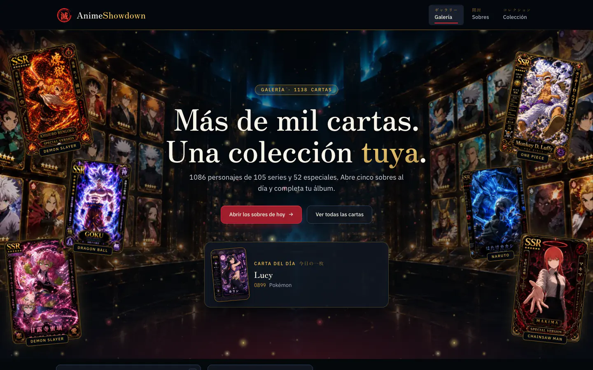
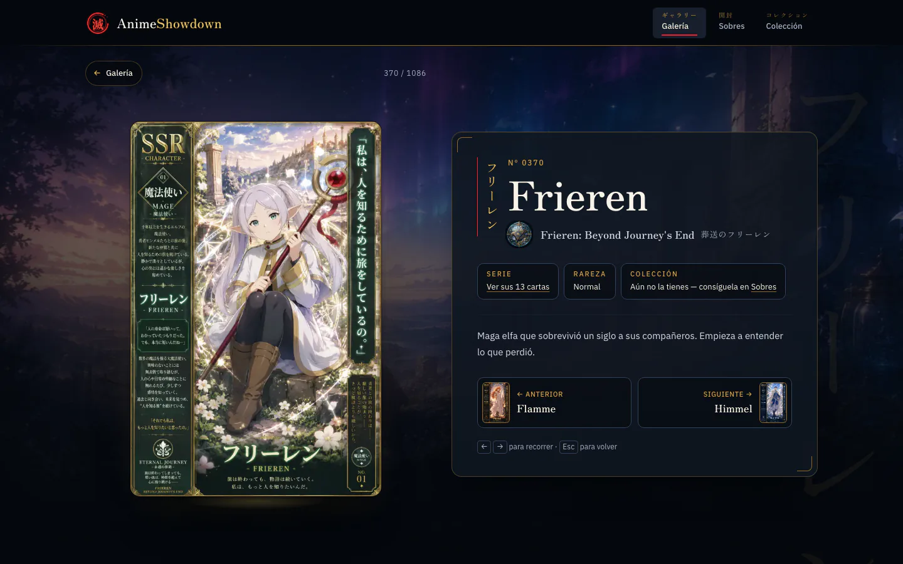
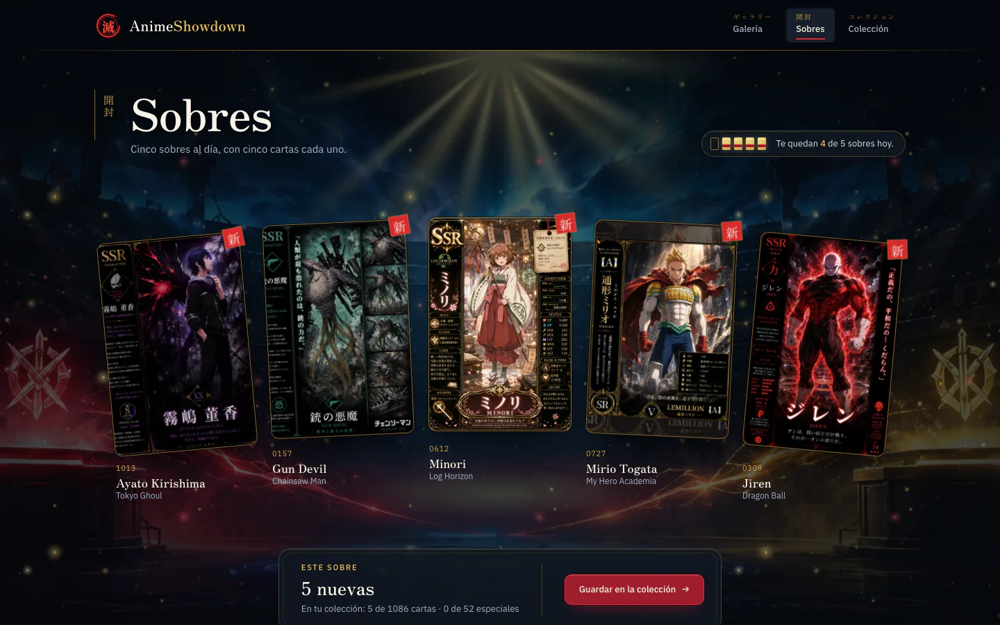
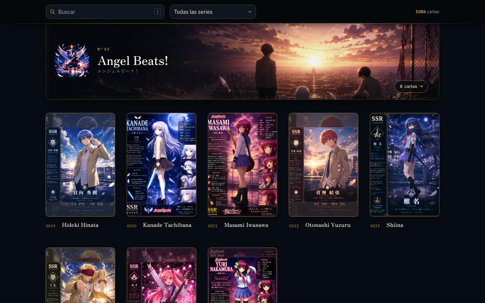
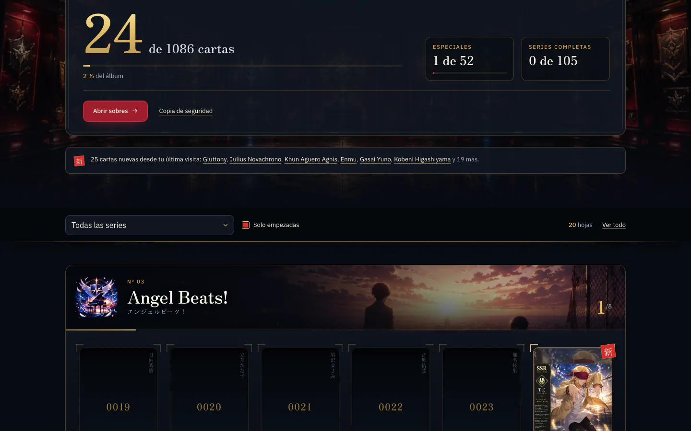
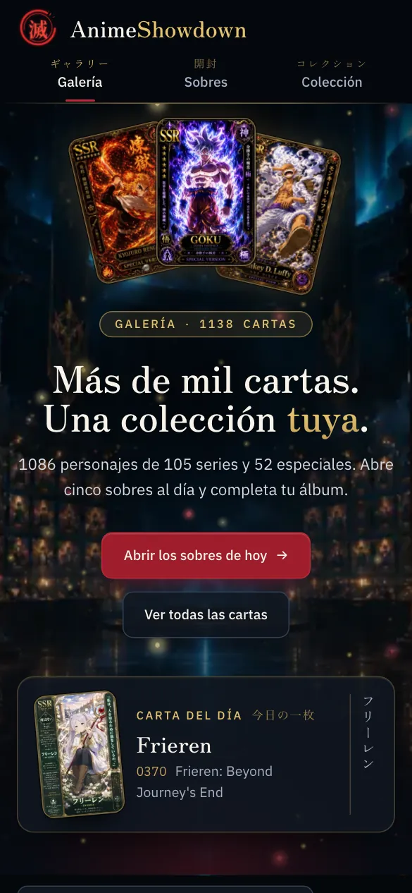

# AnimeShowdown

Galería de cartas de personajes de anime: más de mil cartas para mirar, cinco sobres
al día para abrir y un álbum para completar. Sin cuentas ni servidor.

[](https://diegoalegil.github.io/AnimeShowdown/)




<p>
  
  
</p>
<p>
  
  
</p>
<p align="center">
  
</p>

## Qué es

- **Galería.** 1086 cartas de personajes de 105 series y 52 cartas especiales, agrupadas
  por serie. Búsqueda por nombre o serie (atajo `/`) y filtros por serie o por
  especiales; los filtros quedan en la URL, así que se pueden compartir.
- **Fichas.** Cada carta tiene su propia página, con el nombre japonés del personaje
  en vertical. `←` y `→` recorren la galería, `Esc` vuelve atrás y, si el personaje
  tiene versión especial, la carta se gira para verla.
- **Sobres diarios.** Cada día (a medianoche, hora local) hay 5 sobres de 5 cartas; la
  quinta tiene un 15 % de probabilidad de ser especial. Se rasga el sobre y las cartas
  se voltean una a una, todas a la vez o se salta al resumen. Se guardan en cuanto se
  abre el sobre, así que recargar a mitad no pierde ninguna.
- **Colección.** Un álbum con una hoja por serie y otra para las especiales, con un
  hueco numerado por carta. Vive en el navegador (`localStorage`) y se puede copiar
  como un código para guardarla o llevarla a otro navegador, combinándola con la que
  haya o sustituyéndola.
- **Arte por serie.** Cada serie tiene su escenario y su emblema, que aparecen en la
  galería, en su hoja del álbum y en las fichas.
- **Nombres japoneses** de personajes y series, tomados de AniList.

Las reglas de los sobres están en `src/config.js`.

AnimeShowdown empezó como una plataforma de votaciones con backend propio; esa versión
se retiró y sigue en el historial de git.

## Cómo está hecho

- **React 19**, **React Router 8** y **Vite 8**, con **Tailwind CSS 4** y hojas CSS por
  página. Tests con **Vitest 5** y lint con **ESLint 10** y `eslint-plugin-react-hooks`.
- Tipografías servidas desde el propio sitio con Fontsource: Zen Old Mincho para
  títulos y japonés, IBM Plex Sans para la interfaz.
- Todo es estático: los datos son JSON en `src/data` y las imágenes, WebP en `public/`.
  No hay backend, base de datos ni servicios externos. Scripts de Node validan los
  datos, generan los tamaños de las imágenes y prerenderizan las páginas.
- GitHub Actions ejecuta lint, tests y build en cada push a `main` y publica `dist/`
  en GitHub Pages. Cada ruta (portada, sobres, colección y las 1138 fichas) sale como
  un HTML propio con su título y descripción, y `404.html` arranca la aplicación en
  cualquier otra dirección.

Decisiones de rendimiento:

- **Presupuesto de JavaScript.** El build falla si el JavaScript inicial de la portada,
  sin contar el catálogo de cartas, pasa de 100 kB con gzip (hoy, 97,3 kB). El catálogo
  (unos 73 kB con gzip, crece con cada carta) va en su propio archivo y las demás
  páginas se descargan aparte.
- **Portada prerenderizada.** La sala, el título y las acciones llegan ya pintados en el
  HTML y React los hidrata; la imagen de la sala y las dos fuentes críticas se piden
  desde el `<head>`.
- **Imágenes a medida.** Cada carta tiene versiones de 300, 450 y 600 px en WebP y el
  navegador elige con `srcset`. El japonés de Zen Old Mincho va en ~120 trozos con
  `unicode-range`, cargados después de la hoja principal.
- **Animaciones baratas.** Solo se anima `transform` y `opacity`, y no se usa
  `backdrop-filter` (Safari lo recalcula en cada fotograma de scroll).

## Ejecutarlo en local

Necesitas Node 22.22 o superior (ver `.nvmrc`).

```bash
npm ci
npm run dev       # servidor de desarrollo
npm test          # tests
npm run lint
npm run build     # valida los datos, construye, prerenderiza en dist/ y
                  # comprueba el presupuesto de JavaScript
npm run preview   # sirve dist/
```

Para publicar bajo una subcarpeta, construye con `BASE_PATH=/<carpeta>/ npm run build`.
El despliegue lo fija solo: `/<repositorio>/` en GitHub Pages, o `/` si existe
`public/CNAME`.

## Añadir un personaje

1. Añade una línea al final de `src/data/personajes.json` (con una coma tras la línea
   anterior) con el siguiente número `n`; la numeración debe ser correlativa:

   ```json
   {"id":"eisen","n":1087,"nombre":"Eisen","anime":"Frieren: Beyond Journey's End","animeId":"frieren","img":"img/Frieren/eisen","color":"#5a4a3c","nativo":"アイゼン"}
   ```

   `anime` debe coincidir con el `titulo` de su serie en `src/data/animes.json`; súmale
   uno a su `count`, o crea la entrada si la serie es nueva. `img` va sin extensión.
   `color` es el tono medio de la ilustración, que se ve mientras carga. `nativo`
   (nombre japonés) y `desc` (una frase) son opcionales.

2. Copia la ilustración original en WebP (~1024 px de ancho), p. ej.
   `public/img/Frieren/eisen.webp`, y genera sus tamaños de 300, 450 y 600 px
   (necesita `cwebp`). Si no es 2:3, el script anota además su proporción (`ar`):

   ```bash
   node scripts/generate-tamanos.mjs
   ```

3. Comprueba los datos:

   ```bash
   node scripts/check-data.mjs
   ```

   Valida campos obligatorios, ids únicos, numeración, que la serie y su `count`
   cuadren, que existan los cuatro archivos de imagen y que `ar` corresponda a la
   ilustración. También se ejecuta al construir: si algo falla, el build se para.

Para añadir una **especial**, crea su entrada en `src/data/especiales.json` (id con
prefijo `e-`, `n` correlativo, `personajeId` si es la versión especial de un personaje,
`nombre`, `anime`, `animeId` e `img`), copia la ilustración original en
`public/img/especiales/` y ejecuta `node scripts/generate-especiales.mjs` (necesita
`cwebp` y `dwebp`): genera los tamaños, quita la extensión de `img` si la lleva y
rellena `color` con el tono medio si falta.

El **arte de una serie** se activa con el campo `marca` de `animes.json`, el nombre de
sus archivos en `public/img/marca/`: escenario 16:9 (`-escena-768` y `-escena-1280`),
fondo de la ficha (`-fondo-480`) y emblema (`-simbolo-160` y `-simbolo-320`). Se
generan con `node scripts/generate-marca.mjs <carpeta-de-originales>` (necesita `cwebp`
y `dwebp`); el campo opcional `foco` (p. ej. `"50% 80%"`) indica por dónde recortar el
escenario. Sin `marca`, la serie se muestra sin escenario ni emblema.

## Estructura

```
src/
  pages/          Galeria, Ficha, Sobres, Coleccion
  components/     carta, sobre, álbum, cabecera…
  lib/            catálogo, colección, filtros, coreografías (con sus tests)
  styles/         CSS por página y por pieza
  data/           personajes.json, animes.json, especiales.json
  config.js       reglas de los sobres
public/
  img/            ilustraciones por serie, especiales/ y marca/
scripts/          check-data, check-size, prerender y generadores de imágenes
docs/capturas/    capturas de este README
```

Los motivos de los sobres y dorsos, las brasas, los rayos de luz y la cara aplanada
del sobre salen de los `scripts/generate-*.mjs` correspondientes (ver sus cabeceras).

## Derechos

AnimeShowdown es un proyecto de aficionados sin ánimo de lucro. Los personajes, sus
nombres y las series a las que pertenecen son propiedad de sus autores, estudios y
editoriales. Las ilustraciones de las cartas son obras derivadas creadas por fans y se
muestran solo con fines de exposición; si eres titular de derechos y quieres que se
retire alguna, abre un issue.

El código se publica bajo licencia MIT (ver [LICENSE](LICENSE)). La licencia no cubre
las ilustraciones ni los personajes.
